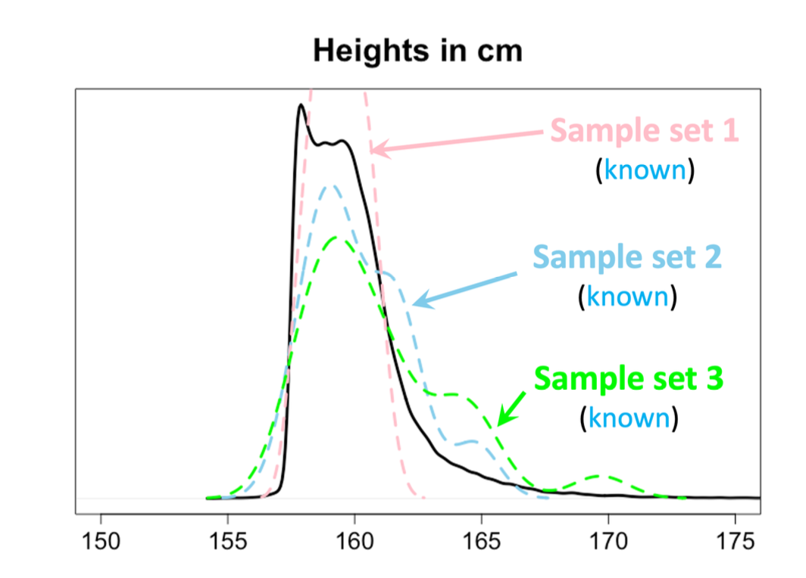
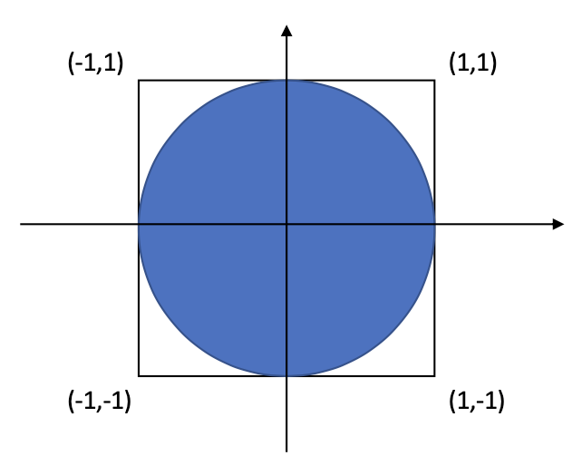
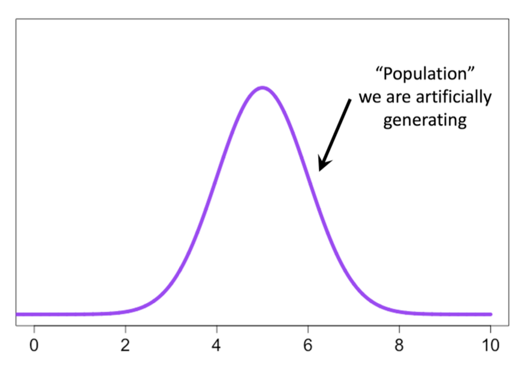
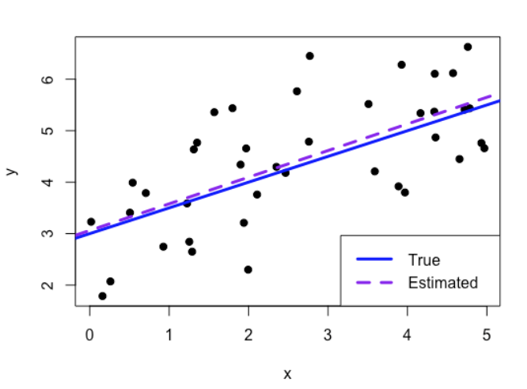
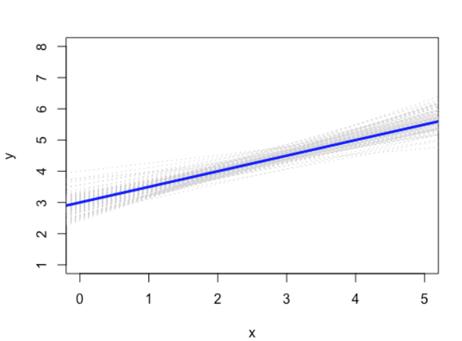
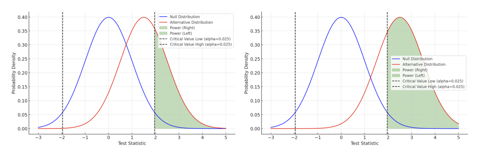

## Warm-Up Questions

**A p-value of 0.50 means there is no relationship between two variables.**  
True or false?

<br>

:::{.fragment}
**If a study has only three observations, can we still perform a statistical analysis?**  
What might go wrong?
:::

<br>

:::{.fragment}
**A 95% confidence interval means there is a 95% probability that the true parameter lies in the interval.**  
True or false?
::: 

<br>

:::{.fragment}
**Would a hypothesis test that rejects $H_0 every time be a good test?**  
Why or why not?
::: 

## Warm-Up Questions

**For paired data, an independent two-sample \(t\)-test is just as appropriate as a paired \(t\)-test.**  
True or false?

<br>

:::{.fragment}
**If a regression model gives \(p > 0.05\), it is reasonable to remove a variable and refit the model until \(p < 0.05\).**  
True or false?
::: 

<br>

:::{.fragment}
**If 846 out of 20,000 hypothesis tests have \(p < 0.05\), we can conclude that those 846 effects are real.**  
True or false? 
:::

## Warm-Up Questions

[What do you think?]{style="color: maroon;"}

<br>

Suppose I apply to **20 PhD programs**, and each program has an acceptance rate of 20/%.

If the decisions were independent, then

$$
P(\text{at least one acceptance})
=
1-(1-0.20)^{20}
\approx 0.988.
$$

So, do I really have a **98.8% chance** of getting into at least one program?

<br>

[What assumption is being made here? Is it reasonable?]{style="color: maroon;"}

## Learning Outcomes for This Week

The purpose of this week's lecture is to ensure that we are on the same page about the *basics*.

-   Introduction to statistical models
-   Designing studies
-   Introduction to simulations
-   Procedures of statistical inference

## Big Picture: The Statistical Modelling Workflow

Statistical modelling is the process of using data to learn about an unknown population.

::: fragment

**1. Population**

**2. Scientific Question**

**3. Study Design + Data Collection**

**4. Statistical Model**

**5. Estimation**

**6. Uncertainty Quantification**

**7. Inference + Scientific Conclusions**

:::

# Introduction to Statistical Models {.center .text-center}

## Population

In statistics, a [population]{style="color: navy;"} is the entire group of individuals or objects we are interested in studying.

::: fragment
We collect a [sample]{style="color: navy;"} from the population and use it to make inferences about the population.
:::

::: fragment
Our sample does [not]{style="color: maroon;"} contain all observations from the population

-   Key idea of statistics!
-   We have limited information (sample) and use it to learn about the unknown population.
-   If the data are a [random sample]{style="color: navy;"} from a population, we can make [reasonable inferences]{style="color: navy;"} about the population characteristics (e.g. mean)
-   The key requirement is that [the sample should be representative of the population]{style="color: navy;"}
:::

## Population 

It is important to clearly define the population of interest.

-   it is not enough to say "I collected *n* observations"
-   the key question is: [Who or what do these observations represent?]{style="color: navy;"}

## Population 

**Example 1: Genetic Studies**

-   Many genetic studies have been conducted primarily in people of European ancestry
-   Models developed using these data often perform poorly in populations with different genetic backgrounds (e.g., people of Asian or African ancestry).

::: fragment
**Example 2: Psychology Experiments**

-   Psychology studies often recruit undergraduate students because they are readily accessible.
-   Do these participants represent all adults?
:::

## Population

{fig-align="center" width="400"}

-   In practice, the true characteristics of a population, such as its mean, variance, or distribution, are typically unknown.

-   Our sample provides limited information about the population, but if it is representative, it can provide a good approximation of the population.

## Population

-   We are often interested in numerical summaries that describe a population.
    -   These numerical summaries are called [parameters]{style="color: navy;"}
        -   e.g. mean height of **all** UofT students
        -   Although the parameter is [unknown]{style="color: navy;"}, it is a [fixed (constant) value]{style="color: navy;"}.
    -   The corresponding summaries computed from a sample are called [statistics]{style="color: navy;"}.

::: fragment
-   Since our conclusions are based on a sample rather than the entire population, every statistical conclusion involves some uncertainty.
:::

## Samples

Random sampling is essential for ensuring that study findings generalize to the population of interest.

**Example**

-   In neuroimaging studies, brain MRI scans are often excluded when excessive head motion reduces image quality.
-   Adolescents with autism spectrum disorder (ASD) may be more likely to move during scanning and, therefore, more likely to be excluded.
-   This can introduce [selection bias]{style="color: maroon;"}, as the analyzed sample may no longer represent the target population.

## Statistical Model

We specify a probability model that represents how we believe the data were generated. This is called the [**data-generating process (DGP)**]{style="color: navy;"} or data-generating model.

::: fragment
-   For example, if $$Y_i \stackrel{\text{i.i.d.}}{\sim} \mathcal{F}$$ then each observation is assumed to be independent and drawn from the same population distribution $\mathcal{F}$.
:::

::: fragment
-   One simple model, which makes relatively strong assumptions, is

$$Y_i \stackrel{\text{i.i.d.}}{\sim} \mathcal{N}(\mu, \sigma^2)$$
:::

## Examples of Statistical Models

[Different research questions require different statistical models!]{style="color: navy;"}

::: incremental
-   (linear) $y_i = \beta_0+ x_i\beta_1 + \epsilon_i$
-   (non-linear) $y_i = \beta_0 + \beta_1sin(x_i) + \epsilon_i$
-   (multiple non-linear) $y_i = f_1(x_{1i}) + f_2(x_{2i}) + ... + f_p(x_{pi}) + \epsilon_i$
-   (multiple non-linear with interactions) $y_i = f_1(x_{1i}) + f_2(x_{2i}) + ... + f_p(x_{pi}) + g_1(f_1(x_{1i})f_2(x_{2i})) +...+ \epsilon_i$
:::

## Statistical Model

-   (Binary response)

    $$y_i \sim \text{Bernoulli}\left( \frac{\exp{(\beta_0 + \beta_1x_i)}}{1 + \exp{(\beta_0 + \beta_1x_1)}}\right)$$ **Note**: this is the default model fit by assuming in `glm(..., family = binomial)` for binary response data

::: fragment
-   (Binary data, non linear)

$$y_i \sim \text{Bernoulli}\left( \frac{\exp{(\beta_0 + \beta_1\sin(x_i))}}{1 + \exp{(\beta_0 + \beta_1\sin(x_i))}}\right)$$
:::

## Comments on the Statistical Model

::: {style="font-size: 0.8em; line-height: 1.2;"}
::: text-center
["All models are wrong, but some are useful" (George Box)]{style="color: maroon;"}
:::

::: fragment
-   Standard errors, confidence intervals, and hypothesis tests all assume that the statistical model has been correctly specified.
    -   They do [not]{style="color: maroon;"} account for errors caused by choosing the wrong model
:::

::: fragment
-   Statistics is not assumption-free!
    -   We make assumptions that we believe are reasonable approximations to reality.
    -   If these assumptions are substantially violated, the consequences may include:
        -   biased estimates
        -   incorrect standard errors
        -   invalid statistical inference
:::

::: fragment
-   Does this make statistical methods useless?
    -   No, many statistical procedures are surprisingly robust to modest violations of their assumptions.
    -   We can evaluate through simulations
:::
:::

## Comments on the Statistical Model

**Example**: Suppose we want to compare the mean outcome before and after treatment using paired observations.

::: fragment
For subject $i = 1, ..., n$, measured at visits $j = 1, 2$, suppose we assume

$$ Y_{ij} \stackrel{\text{i.i.d.}}{\sim} \mathcal{N}(\mu_j, \sigma^2) $$ and test $H_0:\mu_1=\mu_2$.
:::

::: fragment
[What assumption does this model make about repeated measurements from the same subject?]{style="color: navy;"}
:::

::: incremental
-   Is that assumption reasonable?
-   What are the consequences if it is violated?
:::

# Designing Studies {.center .text-center}

## Design of Studies 

::: {style="font-size: 0.8em; line-height: 1.2;"}
1. **Specify the statistical model**
   - Propose a DGP that is a reasonable approximation of reality
   - Define the research question and hypothesis
   - Plan the study design (e.g., sampling strategy and sample size)

::: fragment
2. **Collect the data**
   - Obtain a (ideally random) sample from the population of interest
:::

::: fragment
3. **Estimate the quantities of interest**
   - Estimate the unknown parameters (e.g., using maximum likelihood estimation)
   - Quantify the uncertainty in these estimates (e.g., standard errors or confidence intervals)
:::

::: fragment
4. **Draw statistical conclusions**
   - Construct appropriate test statistics or confidence intervals
   - Make conclusions about the population based on observed data
:::
:::

## Design of Studies

In practice...

::: incremental
-   The assumed model does not have to be the true DGP, it only needs to be a useful approximation
-   If the sample size is small or estimation is unstable, regularization (penalization) may improve estimation
-   If analytic uncertainty quantification is difficult, resampling methods (e.g., the bootstrap) can often be used
:::

## Design of Studies

::: {style="font-size: 0.8em; line-height: 1.2;"}
[**Some cautionary notes**]{style="color: maroon;"}

::: fragment
-   Ideally, the statistical model and hypotheses are specified [**before**]{style="color: navy;"} examining the data.
    -   This is informed by background knowledge, scientific theory, and previous research.
    -   If we repeatedly explore the data until we find an interesting pattern, we may discover relationships that are due to chance rather than true effects.
:::

::: fragment
-   A planned analysis may still be inappropriate after data collection.
    -   [Model assumptions should be checked]{style="color: navy;"} after observing the data.
    -   If assumptions are violated, we may need to modify the analysis
    -   These decisions should be transparently reported.
:::

::: fragment
-   This does not mean we cannot explore data.
    -   Exploratory analyses can identify new patterns, generate hypotheses, and suggest future research directions.
    -   Ideally, these findings should be validated using an independent dataset.
:::
::: 

## Misusing Statistics

::: {style="font-size: 0.8em; line-height: 1.2;"}
Some common practices that can invalidate statistical inference include:

::: incremental
-   **P-hacking**: Trying multiple analyses and only reporting one that produces a statistically significant result
-   **HARKing (Hypothesizing After the Results are Known)**: presenting hypotheses generated from the data as though they were specified before the analysis
-   **Repeated Significance Testing**: repeated analyzing the data as participants are recruited and stopping once a significant result is obtained
-   **Post-hoc Participant Exclusion**: Modifying inclusion or exclusion criteria after examining the data
-   **Using Inappropriate Statistical Methods**: applying statistical tests that do not match the study design, outcome type, or model assumptions
-   **Overfitting**: including predictors without scientific justification or appropriate model selection.
:::

::: fragment
**Key Point**: Statistical inference depends on the entire analysis process. Even a perfectly computed p-value can be misleading if the study design or analysis is flawed.
:::
::: 

## Misusing Statistics

["If you torture the data long enough, it will confess to anything" (Ronald Coase)]{style="color: maroon;"}

::: incremental
-   In principle, the data should be analyzed [only once]{style="color: navy;"} to make [confirmatory]{style="color: navy;"} results. Any other results would be [exploratory]{style="color: navy;"}.
-   A good understanding of the scientific domain is essential for designing appropriate studies, selecting sample sizes, specifying hypotheses, and choosing suitable statistical analyses.
-   A solid understanding of statistics helps you choose models that provide valid and informative inference.
:::

::: fragment
**The goal is not to obtain a small p-value. The goal is to produce evidence that is scientifically credible and statistically valid.**
:::

## Case Study: Clinical Trials

Developing a new drug requires substantial time and financial investment.

**Phase 3 clinical trials** provide the evidence needed for regulatory approval. Because these trials are costly and time-consuming, careful statistical planning is essential.

::: fragment
Poor decisions about:

-   study design,
-   sample size,
-   endpoints,
-   or statistical analysis

can lead to inconclusive or failed trials, resulting in significant financial losses (i.e., [sunk costs]{style="color: maroon;"}) and organizational consequences.
:::

## Case Study: Clinical Trials

[Potential (direct) consequences of sunk cost?]{style="color: maroon;"}

::: incremental
-   In 2019, Roche announced plans to cut 500 jobs in Switzerland following the failure of a key clinical trial for its Alzheimer’s drug.
-   In 2016, The failure of Eli Lilly’s Alzheimer’s drug, solanezumab, in a Phase 3 trial led to significant restructuring and layoffs.
-   Many others!
:::

## Case Study: Clinical Trials

A Statistical Analysis Plan (SAP) promotes transparency, reproducibility, and adherence to regulatory requirements.

The SAP is developed before observing trial outcomes to prevent decisions from being influenced by the results.

::: fragment
Key considerations include:
:::

::: incremental
-   **Study design:** sample size, randomization, trial structure, and stopping rules.
-   **Outcomes:** primary endpoint selection and hypotheses to be tested.
-   **Analysis methods:** statistical models, covariate selection, and software.
-   **Data handling:** missing data methods and subgroup analyses.
-   **Multiple comparisons:** strategies to control false positive findings.
:::

## Main Takeaway

::: {style="font-size: 0.8em; line-height: 1.2;"}
-   **Statistical inference begins before data collection.**
    -   A clear research question, appropriate study design, and reasonable statistical model are essential.

::: fragment
-   **Models are approximations of reality.**
    -   We do not expect a model to be perfectly true, but it should provide a useful representation of the data-generating process.
:::

::: fragment
-   **The analysis process matters.**
    -   Statistical conclusions depend on how data are collected, analyzed, and interpreted—not just on the final statistical test.
:::

::: fragment
-   **Exploration and confirmation are both valuable, but they serve different purposes.**
    -   Exploratory analyses generate hypotheses; confirmatory analyses provide evidence for hypotheses.
:::

::: fragment
-   **The goal of statistics is not to find significant results.**
    -   The goal is to produce reliable, reproducible, and scientifically meaningful evidence.
:::
::: 

# Introduction to Simulation

## Simulations

[Motivating Example]{style="color: maroon;"}

::: {.column width="60%"}
We know from geometry that the area of a unit circle is $\pi$.

However, determining the value of $\pi$ has a long history, requiring increasingly sophisticated mathematical methods.

Modern approaches use calculus to derive and compute this quantity.
:::

::: {.column width="40%"}

:::

## Simulations

::: {style="font-size: 0.8em; line-height: 1.2;"}
[Motivating Example]{style="color: maroon;"}

How can we estimate the area of a circle using simulation?

::: fragment
1.  Generate random points within the square, $[-1,1] \times [-1,1]$.
:::

::: fragment
2.  The probability that a point falls inside the circle is equal to the ratio of the two areas, $A/4$.
:::

::: fragment
3.  Repeat this process many times and estimate the probability by the proportion of points that fall inside the circle.
:::

::: fragment
If $M$ out of 50,000 points fall inside the circle:

$$
\frac{A}{4} \approx \frac{M}{50000}
$$

Therefore:

$$
A \approx 4 \times \frac{M}{50000}
$$
:::
:::

## Simulations

[Motivating Example]{style="color: maroon;"}

```{webr}
set.seed(123) # Ensure reproducibility

n <- 50000

# Generate random points in the square
x <- runif(n, -1, 1)
y <- runif(n, -1, 1)

# Calculate distance from origin
distance <- sqrt(x^2 + y^2)

# Identify points inside the unit circle
inside <- distance <= 1 

# Estimate pi
4 * sum(inside) / n
```

## Simulations

[Motivating Example]{style="color: maroon;"}

Using 50,000 simulated points:

$$\hat{\pi}=3.14432$$

-   The estimate is not exactly $\pi$, but it is close!
-   Because the estimate is based on random sampling, it will vary from simulation to simulation.
-   Increasing the number of simulated points reduces this variability and gives a more precise estimate.

```{r, echo=FALSE, fig.align='center'}
library(ggplot2)
set.seed(123) # Make everything reproducible

n <- 50000

# Generate random coordinates within the unit circle
x <- runif(n, -1, 1)
y <- runif(n, -1, 1)

# Calculate distance from origin
distance <- sqrt(x^2 + y^2)

# Which coordinates fall within the unit circle?
inside <- distance <= 1 # bc the unit circle has radius 1

data <- data.frame(x, y, inside)

ggplot(data, aes(x, y, color = inside)) +
  geom_point(alpha = 0.3, size = 0.5) +
  stat_function(
    fun = function(x) sqrt(1 - x^2),
    xlim = c(-1, 1),
    linewidth = 1
  ) +
  stat_function(
    fun = function(x) -sqrt(1 - x^2),
    xlim = c(-1, 1),
    linewidth = 1
  ) +
  scale_color_manual(
    values = c("TRUE" = "grey20", "FALSE" = "grey80")
  ) +
  coord_fixed() +
  labs(
    x = "",
    y = ""
  ) +
  theme_minimal() +
  theme(
    legend.position = "none"
  )
```

## Simulations

**Why simulate?**

-   We can specify a population to generate random samples\
-   We then can evaluate statistical properties such as bias of an estimate, errors associated with hypothesis testing, coverage probabilities, etc.

::: fragment
Later, we will use simulations to see what happens if

-   the model is misspecified\
-   sample size isn't sufficient
-   statistical misbehaviour is made (e.g. p-hacking)
-   etc.
:::

## Simulations

{fig-align="center" width="400"}

Using simulations, we can generate a population that is bell-shaped, with a fixed mean (e.g., 5) and variance (e.g., 1).

## Simulations

[A simple example: generating random data in R]{style="color: maroon;"}

```{webr}
## We want to draw 10 random samples from a population that follows a normal distribution with mean 5 and standard deviation 1 
## We save this data into an object we call 'data'
```

## Designing Simulation Studies

A simulation study should be carefully designed to answer a specific statistical question.

<br>

A useful framework is **ADEMP** (Morris et al., 2019):

::: incremental
-   **A — Aim**: What statistical question are we trying to answer?

-   **D — Data-generating mechanism**: How will we generate the simulated data?

-   **E — Estimands**: What quantities are we interested in evaluating?

-   **M — Methods**: What statistical procedures are being evaluated or compared?

-   **P — Performance measures**: How will we assess the methods?
:::

<br>

:::: fragment
::: text-center
<small> Morris, T. P., White, I. R., & Crowther, M. J. (2019). Using simulation studies to evaluate statistical methods. *Statistics in Medicine*, 38(11), 2074–2102. </small>
:::
::::

## Simulations

[Example: Evaluating 'Unbiasedness' Empirically]{style="color: maroon;"}

Assume the following model:

$$y_i = \beta_0 + \beta_1x_i + \epsilon_i \quad \text{where} \quad \epsilon_i \stackrel{\text{i.i.d.}}{\sim} \mathcal{N}(0, \sigma^2)$$

Using the ADEMP framework...

::: incremental
-   **A — Aim**: Is the coefficient $\beta_1$ of a linear regression model unbiased?

-   **D — Data-generating mechanism**: We fix $\beta_0, \beta_1, \sigma^2$, and generate a dataset $(x_i, y_i), i=1, ..., n$. We also generate $\epsilon_i \stackrel{\text{i.i.d.}}{\sim} \mathcal{N}(0, \sigma^2)$.

-   **E — Estimands**: We estimate $\beta_1$

-   **M — Methods**: Fitting a linear regression model.

-   **P — Performance measures**: Bias (i.e. $E[\hat{\beta}_1] - \beta_1$))
:::

## Simulations

[Example: Evaluating 'Unbiasedness' Empirically]{style="color: maroon;"}

::: {.column width="60%"}
```{webr}
n <- 40

# Generate the dataset
beta0 <- 3
beta1 <- 0.5
sigma <- 1

x <- 
epsilon <- 
y <-  

# Fit the model and extract beta1
fit <- lm(y~x)

# Estimated beta_1
beta1_hat <- coef(fit)[2]

beta1_hat

```
:::

:::: {.column width="40%"}
::: fragment
{fig-align="center" width="350" height="350"}
:::
::::

## Simulations

[Example: Evaluating 'Unbiasedness' Empirically]{style="color: maroon;"}

Let's repeat this process 10,000 times and calculate the average of all estimated $\beta_1$ values.

::: {.column width="60%"}
```{webr}
beta1_vec <- NULL
x <- runif(n, min = 0, max = 5)

for (sim in 1:10000){
epsilon <- rnorm(n, mean = 0, sd = sigma)

## Repeat in here

}

mean(beta1_vec) 

# Calculate bias 

```
:::

:::: {.column width="40%"}
::: fragment
{fig-align="center" width="350" height="350"}
:::
::::

# Procedures of Statistical Inference

## Hypothesis Testing

In statistics, a [hypothesis]{style="color: navy;"} is a statement of one or more parameters

-   e.g., $H_0: E(X_i) = 100$ and $H_A: E(X_i) \neq 100$

::: fragment
The method of [hypothesis testing]{style="color: navy;"} uses data from a sample to judge whether a statement about a population may be true or not.

-   A simple way you learned is to somehow get a p-value, and compare it to a significance level, $\alpha$
-   If the p-value is less than $\alpha$, we reject the null hypothesis. Otherwise, we fail to reject the null hypothesis.
:::

## Errors in Hypothesis Testing

::: {style="font-size: 0.8em; line-height: 1.2;"}
Since we are making conclusions about the population with limited information, our decision is always prone to some errors.

::: fragment
**Type 1 Error**: False positive; rejecting the null hypothesis when the null hypothesis is actually true

-   P(Type 1 Error) = $\alpha$
:::

::: fragment
**Type 2 Error**: False negative; failing to reject the null hypothesis when the null hypothesis is actually false

-   P(Type 2 Error) = $\beta$
:::

::: fragment
**Power**: the probability that a test will correctly reject a null hypothesis that is false

-   Related to Type 2 Error
-   Power = 1 - P(Type 2 Error) = $1 - \beta$
:::

::: fragment
**Ideally, you want to reduce these two errors,** $\alpha$ and $\beta$ as much as possible.
:::
::: 

## Errors in Hypothesis Testing

[Type I Error]{style="color: maroon;"}

A **Type I error** occurs when we reject $H_0$, even though $H_0$ is true.

$$
P(\text{reject } H_0 \mid H_0 \text{ is true}) = \alpha
$$

:::{.fragment}
The value $\alpha$ is called the **significance level** of the test.
:::

:::{.fragment}
We choose $\alpha$ in advance, which allows us to control the Type I error rate.

A common choice is

$$
\alpha = 0.05.
$$
:::

## Errors in Hypothesis Testing

[Power]{style="color: maroon;"}

The **power** of a hypothesis test is the probability of correctly rejecting $H_0$ when $H_0$ is false.

$$
P(\text{reject } H_0 \mid H_0 \text{ is false}) = 1 - \beta
$$

:::{.fragment}
A test with high power is more likely to detect a real effect when one exists.
:::

:::{.fragment}
Power depends on:

- the **sample size**
- the **effect size**
- the significance level, $\alpha$
:::

## Simulations: Statistical Inference

[Case 1: Behaviours of p-values when $H_0$ is true, $n=50$]{style="color: maroon;"}

We want to test the following hypothesis: $$H_0: \mu = 5 \quad \text{vs} \quad H_A: \mu \neq 5$$ We draw 50 samples from a population that has a mean of 5, i.e., we are setting up a scenario where the [null hypothesis is true]{style="color: navy;"}.

Then, using the simulated data, we test the hypothesis.

## Simulations: Statistical Inference

[Case 1: Behaviours of p-values when $H_0$ is true, $n=50$]{style="color: maroon;"}

```{webr}
# Generate 50 observations for a normal distribution with mu = 5 


# Test the null hypothesis using a t-test 


```

## Simulations: Statistical Inference

[Case 1: Behaviours of p-values when $H_0$ is true, $n=50$]{style="color: maroon;"}

If we repeat this simulation 50,000 times, and then plot a histogram of the resulting p-values, we get the following.

```{r, echo=FALSE, fig.align='center'}
set.seed(123) # Make everything reproducible

n <- 50000
pvalue <- NULL

for(i in 1:n) { 
  data = rnorm(50, 5, 1)
  test <- t.test(data, mu=5, alternative = "two.sided")
  
  pvalue[i] <- test$p.value
  }

hist(pvalue, main = "Histogram of p-values") 
abline(v = 0.05, col = "red", lty = 2, lwd = 4)
```

Note that about $5\%$ of the p-values are less than 0.05.

## Simulations: Statistical Inference

[Case 2: Behaviours of p-values when $H_0$ is false ($\mu = 5.1$), $n=50$]{style="color: maroon;"}

```{webr}
# Generate 50 observations for a normal distribution with mu = 5.1 


# Test the null hypothesis using a t-test 


```

## Simulations: Statistical Inference

[Case 2: Behaviours of p-values when $H_0$ is false ($\mu = 5.1$), $n=50$]{style="color: maroon;"}

Again, we repeat this simulation 50,000 times - More p-values are shifted to 0 - Is this an expected result?

```{r, echo=FALSE, fig.align='center'}
set.seed(123) # Make everything reproducible

n <- 50000
pvalue <- NULL

for(i in 1:n) { 
  data = rnorm(50, 5.1, 1)
  test <- t.test(data, mu=5, alternative = "two.sided")
  
  pvalue[i] <- test$p.value
  }

hist(pvalue, main = "Histogram of p-values") 
abline(v = 0.05, col = "red", lty = 2, lwd = 4)
```

## Simulations: Statistical Inference

[Case 3: Behaviours of p-values when $H_0$ is false ($\mu = 5.1$), $n=200$]{style="color: maroon;"}

We increase the sample size from $n=50$ to $n=200$ and repeat the simulation 50,000 times - More p-values are shifted to 0 - Is this an expected result?

```{r, echo=FALSE, fig.align='center'}
set.seed(123) # Make everything reproducible

n <- 50000
pvalue <- NULL

for(i in 1:n) { 
  data = rnorm(200, 5.1, 1)
  test <- t.test(data, mu=5, alternative = "two.sided")
  
  pvalue[i] <- test$p.value
  }

hist(pvalue, main = "Histogram of p-values") 
abline(v = 0.05, col = "red", lty = 2, lwd = 4)
```

## Power

Remember, when talking about power we are assuming the null hypothesis is **false** (i.e., the alternative is true)

{fig-align="center" width="800"}

Above, we see clearly that $\alpha$, the effect size and sample size have an effect on power.

## Empirical Understanding of Statistics

[Simulation lets us ask: *What actually happens?*]{style="color: maroon;"}

We can use simulation to investigate the behaviour of statistical methods when:

:::{.fragment}
- **assumptions are violated**  
  *e.g., non-normal or skewed errors*
:::

:::{.fragment}
- **sample sizes are small**  
  *e.g., does the Type I error rate remain at $\alpha$?*
:::

:::{.fragment}
- **models are misspecified**  
  *e.g., ignoring within-subject correlation*
:::

:::{.fragment}
- **we want to evaluate statistical properties**  
  *e.g., bias, power, or confidence interval coverage*
:::

## Summary

::: text-center
Throughout the course, we will return to the same questions:

<br>

**What assumptions does the model make?**

**How do we estimate uncertainty?**

**How well does the model represent the data-generating process?**

<br>

We will use **simulations** to investigate the properties of statistical methods and evaluate how well they perform under different scenarios.
:::
