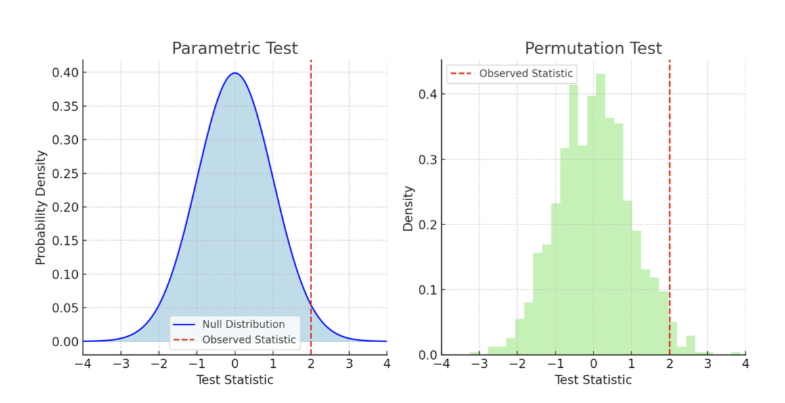
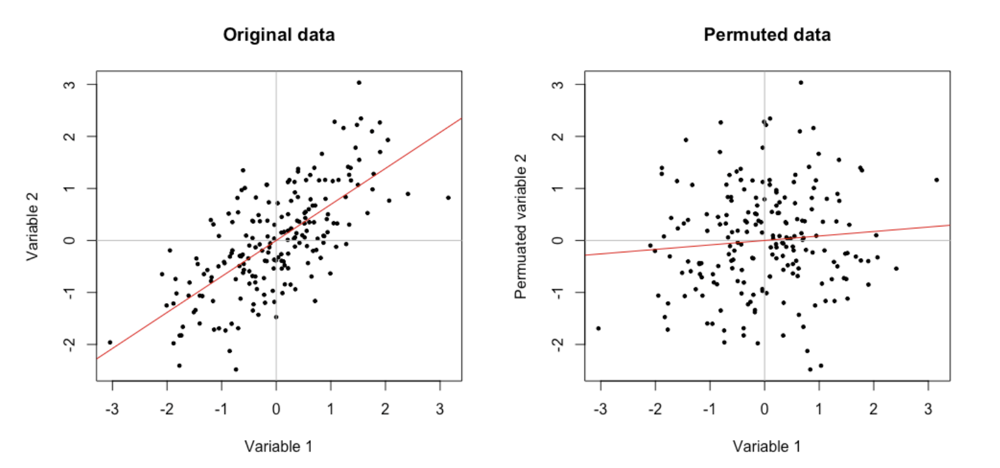
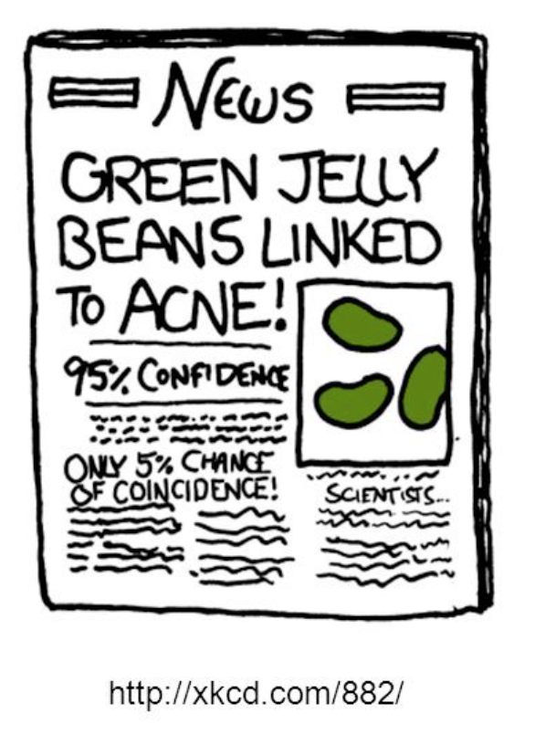
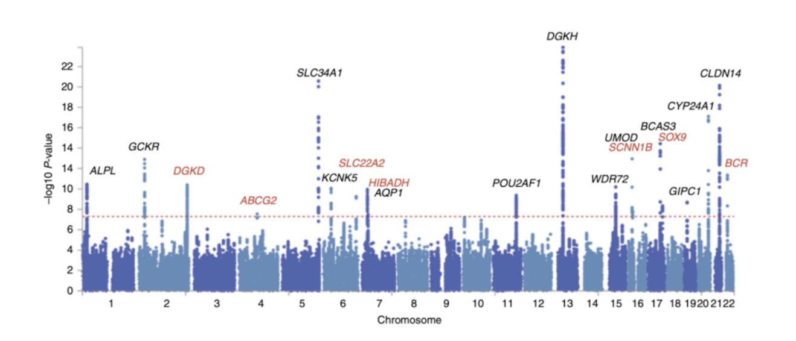
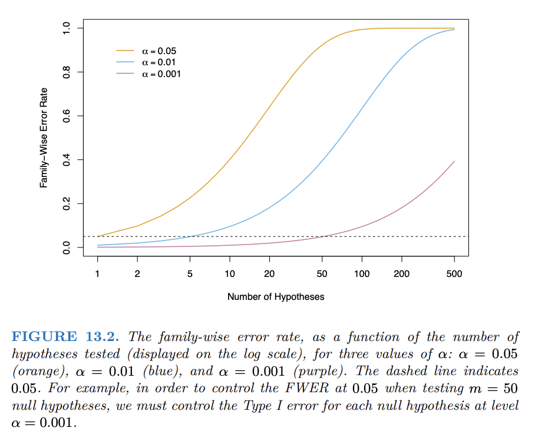
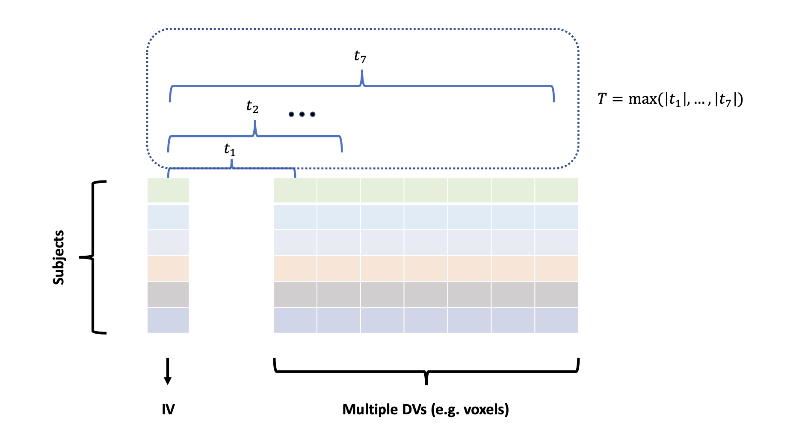
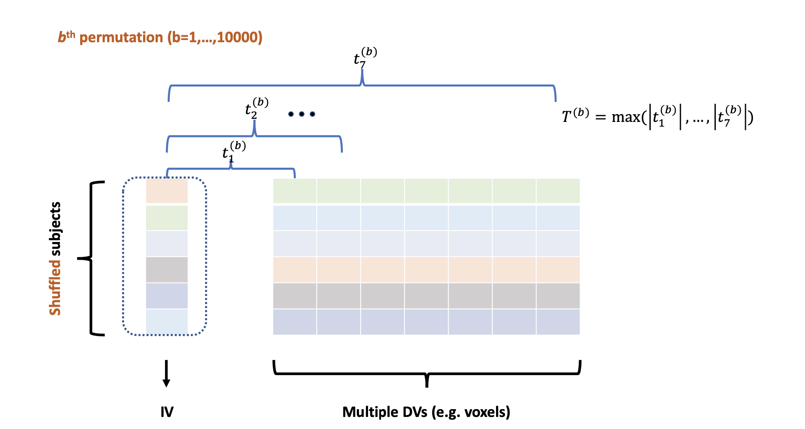

## Review 

To review the topics we discussed from last lecture, we will do an activity. In this week's announcement I asked you all to read the paper *"Chocolate with high Cocoa content as a weight-loss accelerator"* by Bohannon et al.

<br>

With 2-3 other people around you, go through the paper (a pdf can be found on the course website) and think about the following questions: 

  - What is the research question?
  - Who is the population? How did the researches sample that population? 
  - What do you think of the study design? 
  - Are the results valid? 
  - Would you be able to reproduce this study?

## Today's Lecture

By the end of this lecture, you should be able to:

  - Explain the logic of a permutation test and construct a permutation-based null distribution.
  - Describe why conducting many hypothesis tests increases the risk of false-positive findings.
  - Compare family-wise error rate (FWER) and false discovery rate (FDR), and identify when each is appropriate.
  - Apply Bonferroni and FDR adjustments to account for multiple comparisons.
  - Recognize how inappropriate selection and testing practices can inflate error rates and reported effect sizes.

# Permutation Tests

## Motivating Example

Researchers have developed a new drug that inhibits a mouse's ability to run through a maze. Using three mice receiving the drug and three controls receiving a placebo, they measured the time required to complete the maze.

| Group   | Running times (seconds) |
|:--------|:------------------------|
| Drug    | 30, 25, 20              |
| Placebo | 18, 21, 22              |

We want to test

$$
H_0:\mu_{\text{Drug}}=\mu_{\text{Placebo}}
\qquad \text{versus} \qquad
H_1:\mu_{\text{Drug}}>\mu_{\text{Placebo}}.
$$

:::{.fragment}
The two-sample $t$-test gives a $p$-value of approximately $0.122$.
::: 

## Why Consider a Permutation Test?

With such a small sample, the parametric $p$-value may be unreliable.

Can we test the hypothesis without relying as heavily on parametric assumptions?

<br> 

:::{.fragment}
A [**permutation test**]{style="color: maroon;"} is a *non-parametric* method that tests a null hypothesis by "rearranging" the observed data.

<br> 

[Key Idea]{style="color: maroon;"}: If $H_0$ is true (there is no difference between the population means) then swapping the group labels should not make a systematic difference.

:::

## Motivating Example Revisited

Shuffle the group labels while keeping three observations in each group.

| Permutation | Drug | Placebo | $\widehat\mu_D-\widehat\mu_P$ | $t$ statistic |
|:--------------|:--------------|:--------------|--------------:|--------------:|
| 1 (observed) | 30, 25, 20 | 18, 21, 22 | 4.67 | 1.49 |
| 2 | 30, 25, 18 | 20, 21, 22 | 3.33 | 2.11 |
| 3 | 30, 25, 21 | 18, 20, 22 | 5.33 | 2.76 |
| $\vdots$ | $\vdots$ | $\vdots$ | $\vdots$ | $\vdots$ |
| 20 | 18, 21, 22 | 30, 25, 20 | -4.67 | -1.49 |

:::{.fragment}
There are three permutations whose differences in means are at least $4.67$:

$$
p_{\text{perm}}=\frac{3}{20}=0.15.
$$

Using the $t$ statistic gives the same result: three permuted statistics are at least $1.49$.
::: 

## Permutation Test: Procedure

::: algorithm-box
1.  State the null hypothesis.
2.  Calculate the test statistic from the observed data.
3.  Shuffle (permute) the data: Under the null hypothesis, the grouping or labeling of the data is arbitrary. Therefore, repeatedly shuffle or permute the data to create new datasets where the null hypothesis holds true.
4.  Recalculate the test statistic for each permutation: After each shuffle, calculate the test statistic on the permuted data.
5.  Use the permuted statistics to construct the null distribution.
6.  Compute the $p$-value as the proportion of permuted statistics at least as extreme as the observed statistic.
:::

## Connection to Parametric Tests

{fig-align="center" width="75%"}

Parametric and permutation tests differ mainly in how they obtain the **null distribution** (the distribution of the test statistic under $H_0$).

  - Parametric: obtained by deriving the distributional properties (assumptions) 
  - Permutation: obtained by a data-driven manner (e.g. without assuming CLT or distributional form of a population)

## Comparing Null Distributions Empirically

```{webr}
set.seed(442)

# Scenario 1: normally distributed samples
x1 <- rnorm(n = 10) # 10 samples from group 1 (normal)
x2 <- rnorm(n = 10) # 10 samples from group 2 (normal)

# Scenario 2
# x1 <- rexp(n = 10, rate = 1) # 10 samples from group 1 (skewed)
# x2 <- rexp(n = 10, rate = 1) # 10 samples from group 2 (skewed)

observed_t <- t.test(x1, x2, var.equal = TRUE)$statistic

x <- c(x1, x2)
perm_t <- numeric(10000)

for (i in 1:10000) {
  shuffled <- sample(x) # shuffle
  x1_shuffled <- shuffled[1:10] # permuted group 1
  x2_shuffled <- shuffled[11:20] # permuted group 2

  perm_t[i] <- t.test(
    x1_shuffled,
    x2_shuffled,
    var.equal = TRUE
  )$statistic
}
```

## Comparing Null Distributions Empirically

```{webr}
hist(
  perm_t,
  probability = TRUE,
  breaks = 30,
  col = "#d9ead3",
  border = "white",
  main = "Permutation null distribution",
  xlab = "t statistic"
)

curve(
  dt(x, df = length(x1) + length(x2) - 2),
  add = TRUE,
  col = "#7a263a",
  lwd = 3
)

abline(v = observed_t, lty = 2, lwd = 2)
```

## Permutation Test for Other Methods

Suppose we are testing $H_0:\rho_{XY}=0$ for the simple linear regression $Y\sim X$.

Under $H_0$, we can randomly shuffle the order of $X$ to break its relationship with $Y$ while preserving the observed values of both variables.

{fig-align="center" width="75%"}

## Permutation Test for Other Methods

Consider

$$
y_i=\beta_0+x_i\beta_1+z_i\beta_2+w_i\beta_3+\epsilon_i,
\qquad
H_0:\beta_1=\beta_2=0.
$$

Here, $\beta_1$ and $\beta_2$ describe the effects of $x_i$ and $z_i$ on $E(Y_i)$ while controlling for $w_i$.

<br> 

:::{.fragment}
Possible methods to shuffle:

-   We cannot shuffle $w_i$: this does not break the relationship between $(x_i,z_i)$ and $y_i$.
-   We should not shuffle $y_i$: this also breaks the relationship between $y_i$ and $w_i$.
-   We should not shuffle $x_i$ and $z_i$ separately: their dependence should be preserved.
-   We can shuffle the pairs $(x_i,z_i)$ together. This preserves their mutual dependence and leaves the relationship between $y_i$ and $w_i$ intact.
::: 

## Permutation Tests: Summary

-   **Few distributional assumptions:** Unlike a parametric test, a permutation test does not assume a particular population distribution.
-   **Versatile:** It can be used with many statistics, including differences in means, medians, variances, and correlations.
-   **Computationally intensive:** Many permutations may be needed, especially for large datasets.  
-   We need to take care when permutating as to not break relationships that are allowed under the null hypothesis

# Multiple Testing

## The Jelly Bean Experiment

::::: columns
::: {.column width="55%"}
**Do jelly beans cause acne?**

-   We could conduct a randomized experiment and compare the mean number of acne lesions between treatment and control groups.
-   Suspecting that the relationship may depend on jelly bean colour, we test each colour separately.
    -   15 colours $\Rightarrow$ 15 two-sample $t$-tests.
    -   For each colour, reject $H_0$ when $p<0.05$.

<br> 

<br>

<br>

:::{.citation}
This is a pedagogical example, not an actual study.
::: 
:::

::: {.column width="45%"}
:::{.fragment}
[Question]{style="color: maroon;"}: What problem might arise? 

```{=html}
<textarea class="annotation-box"
          placeholder="Type notes here..."></textarea>
```
:::
:::
:::::


## The Jelly Bean Experiment 

{fig-align="center" width="35%"}

## Examples from Genetics: Genome-Wide Association Study

-   A genome-wide association study fits a model relating a trait (e.g. cholesterol level) to each genetic variant.
-   A modern GWAS may test approximately 4–5 million variants.
-   A commonly used significance threshold is $p<5\times10^{-8}.$

{fig-align="center" width="75%"}

:::{.citation}
 Howles, S. A., Wiberg, A., Goldsworthy, M., Bayliss, A. L., Gluck, A. K., Ng, M., ... & Furniss, D. (2019). Genetic variants of calcium and vitamin D metabolism in kidney stone disease. Nature communications, 10(1), 5175.
:::

## The Dead Salmon Experiment

In this experiment:

-   The brain of a dead Atlantic salmon was scanned in an MRI machine.
-   The salmon was presented with an open-ended mentalizing task.
-   The imaging data were analyzed using a standard fMRI pipeline.
-   Each voxel was modeled separately using a GLM, producing a $p$-value at every location.

:::{.citation}
Bennett, C. M., Miller, M. B., & Wolford, G. L. (2009). Neural correlates of interspecies perspective taking in the post-mortem Atlantic Salmon: An argument for multiple comparisons correction. Neuroimage, 47(Suppl 1), S125.
:::

## The Dead Salmon Experiment: Result

Several apparently active voxels were identified inside the salmon's brain cavity, even though no voxel should truly activate.

[Question]{style="color: maroon;"}: What went wrong? 

```{=html}
<textarea class="annotation-box"
          placeholder="Type notes here..."></textarea>
```


:::{.citation}
Lyon, L. (2017). Dead salmon and voodoo correlations: should we be sceptical about functional MRI?. Brain,
140(8), e53-e53.
:::

## Simulation in R

Generate data for 50 jelly bean colours when every null hypothesis is true. Test each colour separately at $\alpha=0.05$.

```{webr}
set.seed(442)

data <- matrix(
  rnorm(10 * 50, mean = 0),
  nrow = 10,
  ncol = 50
)

pvalues <- numeric(50)

for (j in seq_len(50)) {
  jelly <- data[, j]
  pvalues[j] <- t.test(jelly, mu = 0)$p.value
}

sum(pvalues < 0.05) # how many are less then 0.05?
```

## Repeating the Simulation

To estimate how often the $p<0.05$ rule produces at least one false positive:

1.  Generate data for 50 jelly bean colours when every null hypothesis is true.
2.  Calculate 50 $p$-values and count the rejected hypotheses.
3.  Repeat many times and store the counts.

## Repeating the Simulation

```{webr}
set.seed(442)

false_positives <- numeric(10000)

for (sim in seq_len(10000)) {
  data <- matrix(rnorm(10 * 50), nrow = 10, ncol = 50)
  pvalues <- numeric(50)

  for (j in seq_len(50)) {
    pvalues[j] <- t.test(data[, j], mu = 0)$p.value
  }

  false_positives[sim] <- sum(pvalues < 0.05)
}

mean(false_positives > 0)
```

## How Often Do We Get a False Positive?

```{webr}
barplot(
  table(false_positives),
  col = "#b7c9e2",
  border = "white",
  xlab = "Number of false positives",
  ylab = "Frequency"
)
```

When 50 null hypotheses are tested separately at $\alpha=0.05$, there is approximately a **92% chance** of observing at least one false positive.

## Accounting for Multiple Comparisons

Two common ways to address multiple comparisons are:

-   **Family-wise error rate (FWER)**
-   **False discovery rate (FDR)**

The choice between FWER and FDR should depend on the research context and the goal of the analysis.

## Family-Wise Error Rate (FWER)

-   The Type I error rate describes a single hypothesis test.
-   The [**family-wise error rate (FWER)**]{style="color: maroon;"} is the probability of making at least one false positive across a family of tests.
-   FWER guards against **any** false positive: “none versus at least one.”

## What Determines the FWER?

-   **Number of tests:** More tests require a more stringent threshold.
-   **Desired FWER:** Often set to 5%.

If 20 independent null hypotheses are each tested at $\alpha=0.05$, then $P(\text{at least one false positive}) \approx 0.64.$

{fig-align="center" width="60%"}


## FWER Method 1: Bonferroni Correction

To control the FWER at level $\alpha$ across $m$ tests, use the per-test threshold $\alpha^*=\frac{\alpha}{m}.$

Then, the FWER would be:

$$
\begin{aligned}
\operatorname{FWER} 
&=P_{H_0}(\text{at least one of m null hypotheses are rejected}) \\
&=P_{H_0}\!\left(\bigcup_{j=1}^{m}
\left\{p_j\leq\frac{\alpha}{m}\right\}\right)\\
&\leq\sum_{j=1}^{m}P_{H_0}\!\left(p_j\leq\frac{\alpha}{m}\right)\\
&=m\left(\frac{\alpha}{m}\right)=\alpha.
\end{aligned}
$$

## FWER Method 1: Bonferroni Correction

-   Bonferronni correction is very simple and guaranteed to control FWER: $\operatorname{FWER}\leq\alpha$.
-   Can be conservative because the bound may be strict.
-   In the dead salmon study, $p<0.001$ would control FWER at 5% only if there were 50 tests:

$$
0.001=\frac{0.05}{50}.
$$

With many more voxels, that threshold is too loose.

## FWER Method 2: Permutation

Controlling FWER is equivalent to setting a threshold for $p_{\min}=\min\{p_1,\ldots,p_m\}$ or, for one-sided tests, $T_{\max}=\max\{t_1,\ldots,t_m\}.$

At least one rejected hypothesis is equivalent to the minimum $p$-value crossing its threshold, or the maximum test statistic crossing its threshold. 

:::{.fragment}
Permuation testing allows us to set a threshold for the maximum test statistic, providing a method to control FWER.

Permutation-based control of FWER is exact, and does not depend on independence assumptions of p values.
::: 

## FWER Method 2: Permutation

{fig-align="center" width="80%"}
## FWER Method 2: Permutation

{fig-align="center" width="80%"}

## FWER Method 2: Permutation

```{webr}
set.seed(442)

y <- rnorm(20)                 # 20 subjects
X <- matrix(rnorm(20 * 40),    # 20 subjects, 40 features
            nrow = 20)

observed_max <- max(abs(cor(X, y)))
permuted_max <- numeric(1000)

for (b in seq_len(1000)) {
  y_shuffled <- sample(y)
  permuted_max[b] <- max(abs(cor(X, y_shuffled)))
}

mean(permuted_max >= observed_max) # permutation test p-value
```

## Permutation-Based FWER Control

```{webr}
hist(
  permuted_max,
  breaks = 30,
  col = "grey80",
  border = "white",
  main = "Null distribution of the maximum statistic",
  xlab = "Maximum absolute correlation"
)

abline(
  v = quantile(permuted_max, 0.95),
  col = "#7a263a",
  lty = 2,
  lwd = 3
)
```

Permutation-based FWER control accounts for dependence among the tests and does not require independent $p$-values.

## False Discovery Rate (FDR)

Controlling FWER can be conservative, and there is a relevant concept of false positive rates in multiple comparisons: [**False Discovery Rate (FDR)**]{style="color: maroon;"}.

:::{.fragment}
When $m$ hypotheses are tested, each test belongs to one of four categories $(V, U, S, W )$:

| Decision            | $H_0$ is true | $H_0$ is false | Total |
|:--------------------|--------------:|---------------:|------:|
| Reject $H_0$        |           $V$ |            $S$ |   $R$ |
| Do not reject $H_0$ |           $U$ |            $W$ | $m-R$ |
| Total               |         $m_0$ |        $m-m_0$ |   $m$ |

::: 

:::{.fragment} 
- Ideally, we want to minimize the number of false positive $(V)$
:::

## False Discovery Rate (FDR)

| Decision            | $H_0$ is true | $H_0$ is false | Total |
|:--------------------|--------------:|---------------:|------:|
| Reject $H_0$        |           $V$ |            $S$ |   $R$ |
| Do not reject $H_0$ |           $U$ |            $W$ | $m-R$ |
| Total               |         $m_0$ |        $m-m_0$ |   $m$ |

FDR controls the expected proportion of false positives among the *hypotheses you rejected* $(V/R)$.

:::{.fragment}
If FDR is controlled at 5%, approximately 5% of the statistically significant findings are expected to be false positives in the long run.

    - FDR is more lenient than FWER: it tolerates some false positives in exchange for greater ability to identify real effects.
:::
## False Discovery Rate (FDR): Implementation in R

1.  Choose the desired FDR level, such as 5% and obtain the raw $p$-values.
3.  Use `p.adjust()` to calculate FDR-adjusted $p$-values.
4.  Declare adjusted $p$-values below 0.05 significant.

```{webr}
pvalues <- c(0.0001, 0.58, 0.03, 0.007,
             0.95, 0.07, 0.15, 0.37)

p.adjust(pvalues, method = "fdr")
```

In this example, hypotheses 1 and 4 are rejected.

## When Should We Choose FWER or FDR?

Make this choice **before** analyzing the data to avoid p-hacking.

General recommendations: 
  - Use FWER when you care about the [specific hypotheses]{style="color: maroon;"} being tested, i.e. you want to minimize the risk of any false positives for individual comparisons.
  
  - Choose FDR when you care more about the [number of significant findings]{style="color: maroon;"} (for further investigations) rather than the specific hypotheses.

**Do not choose FDR simply because it produces more significant findings.**

# Inappropriate Uses of Multiple Comparisons

## An Apparently Reasonable Analysis

Suppose an fMRI dataset contains 100,000 voxels.

1.  Remove voxels with “uninteresting” correlations, such as $|r|<0.5$, leaving 500 voxels.
2.  Apply Bonferroni correction only to those 500 voxels and analyze the voxels satisfying $p<\frac{0.05}{500}.$

## What's Wrong with the Previous Analysis?

-   **Double dipping:** The same data were used first to select the 500 strongest correlations and then to test them.
-   The procedure resembles a multiple-comparison correction, but it does not properly control FWER.

**Valid alternatives:**

1.  Pre-specify the 500 voxels [before examining the data]{style="color: maroon;"}, then test them using $p<0.05/500$.
2.  Apply Bonferroni correction to all 100,000 voxels using $p<0.05/100000$.

# Puzzlingly High Correlations

## “Voodoo” Correlations

Some fMRI studies of emotion, personality, and social cognition reported [extremely high (sometimes greater than 0.8) correlations]{style="color: maroon;"} between brain activation and personality measures.

-   Neuroimaging measurements are [noisy]{style="color: maroon;"} and often have low reliability.
-   Behavioural measurements, such as reaction time and accuracy, are also [noisy]{style="color: maroon;"}.
-   How can two noisy measurements correlate above 0.8, sometimes with fewer than 25 subjects?

:::{.citation}
Vul, E., Harris, C., Winkielman, P., & Pashler, H. (2009). Puzzlingly high correlations in fMRI studies of emotion, personality, and social cognition. Perspectives on psychological science, 4(3), 274-290.
:::

## Simulation: A Correlation of 0.8 by Chance

1.  Simulate 40,000 features for each of 20 subjects.
2.  Simulate an unrelated behavioural measure for the same subjects.
3.  Calculate the correlation between the behaviour and each feature.

```{webr}
set.seed(442)

X <- matrix(
  rnorm(20 * 40000),
  nrow = 20,
  ncol = 40000
)

y <- rnorm(20)
correlations <- cor(X, y)

max(correlations)
```

## Simulation: A Correlation of 0.8 by Chance

```{webr}
hist(
  correlations,
  breaks = 50,
  col = "grey80",
  border = "white",
  main = "40,000 sample correlations under the null",
  xlab = "Sample correlation"
)

abline(v = max(correlations), col = "#7a263a", lwd = 3)
```

Even though every population correlation is zero, the largest sample correlation can be close to 0.8.

## Simulation: A Correlation of 0.8 by Chance

```{webr}
selected <- which.max(correlations)
selected_feature <- X[, selected]

plot(
  selected_feature,
  y,
  pch = 19,
  xlab = "Selected feature",
  ylab = "Behavioural measure"
)

abline(lm(y ~ selected_feature), col = "#7a263a", lwd = 3)
abline(h = 0, col = "#244062", lty = 2, lwd = 2)
```

The fitted red line is a severely inflated sample effect created by selecting the largest of 40,000 correlations. The true population relationship is flat.

## Lessons from the Simulation

-   Passing a stringent threshold is difficult, for example, Bonferroni gives $\frac{0.05}{40000}=1.25\times10^{-6}.$

-   Nevertheless, when FWER is controlled at 5%, a false positive can still occur with probability up to 5%.
-   If a feature passes the threshold by chance, its reported sample effect size may appear very large even though the population effect is zero.
-   Effect sizes from features selected after many comparisons can be severely inflated.

## Lecture Summary

-   Permutation tests build a null distribution by rearranging the observed data under $H_0$.
-   When testing many hypotheses, the chance of at least one false positive can be much larger than the per-test Type I error rate.
-   FWER controls the probability of any false positive; FDR controls the expected proportion of false discoveries among rejected hypotheses.
-   Bonferroni is simple but can be conservative; permutation methods can account for dependence among tests.
-   Selection and testing with the same data can inflate error rates and effect-size estimates.

<br> 

**Announcements:** Assignment 1 now available on course website! Due Oct. 2nd 

**Next Class:** Linear Models