## Review: Case Study Physical Activity and Menstrual Pain

In a fictional observational study, 180 adults each report their menstrual pain score for one cycle, weekly physical activity, age, and whether they have endometriosis.

Participants with endometriosis tend to report more pain and less physical activity. Pain scores also vary much more among participants with endometriosis.

Researchers want to determine whether:

- Physical activity is associated with pain after adjusting for age and endometriosis.
- Age and endometriosis jointly contribute to explaining pain beyond physical activity.

**Discuss in groups. Develop an analysis plan.**

1. How would you check whether a [linear model]{.maroon} makes sense for these data?
2. Would you recommend [weighted least squares]{.maroon}? Why or why not? If so, what should the weights be, and how would you obtain them?
3. How would you tackle each [research question]{.maroon}? Specify your model(s), hypotheses, and tests. 

## Table of contents

- Modeling binary and count data
- Maximum likelihood and exponential family
- Parameter estimation in GLMs
- Statistical inference in GLMs
- Checking assumptions
- Modeling considerations

# Modeling binary and count data

## Bernoulli and Poisson distributions

[Bernoulli]{.maroon}: used to model binary data, $y\in\{0,1\}$.

$$
y\sim\operatorname{Bernoulli}(p),\qquad f_Y(y)=p^y(1-p)^{1-y}.
$$

- $E(y)=p$ and $\operatorname{Var}(y)=p(1-p)$.
- One parameter ($p$) characterizes both the mean and variance.

:::{.fragment}
[Poisson]{.maroon}: used to model counts, $y\in\{0,1,2,\ldots\}$.

$$
y\sim\operatorname{Poisson}(\lambda),\qquad f_Y(y)=\frac{e^{-\lambda}\lambda^y}{y!}.
$$

- $E(y)=\lambda$ and $\operatorname{Var}(y)=\lambda$.
- One parameter ($\lambda$) characterizes both the mean and variance.
::: 

## Modeling binary data: covariate effects

- Consider the example where we are modelling the admission rate of an MBA program ($p_i$) based on each applicant's college GPA ($x_i$) (this example is American).

:::: {.columns}
::: {.column width="57%"}
[Logistic regression]{.maroon} specifies

$$y_i\mid x_i\sim\operatorname{Bernoulli}(p_i),$$
$$\log\left(\frac{p_i}{1-p_i}\right)=\beta_0+x_i\beta_1,$$
$$\implies p_i=\frac{e^{\beta_0+x_i\beta_1}}{1+e^{\beta_0+x_i\beta_1}}.$$
There is no separate additive $\epsilon_i$ term: randomness comes from the Bernoulli distribution.
:::
::: {.column width="43%"}
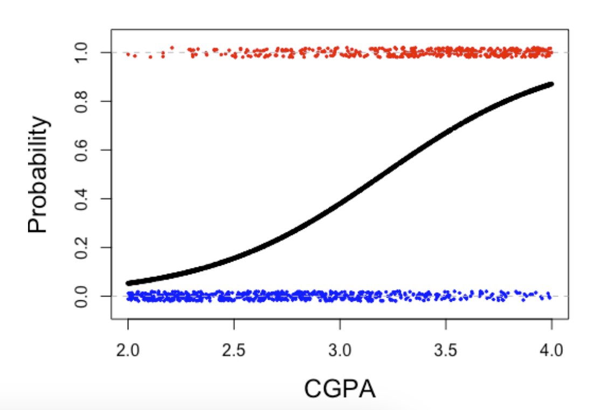{fig-align="center" width="100%"}
:::
::::

## Modeling binary data: interpretation  

When fitting a logistic regression, it is modelling by $y_i \sim \text{Bernoulli}(p_i)$ where 

$$\log\left(\frac{p_i}{1-p_i}\right)=\beta_0+x_i\beta_1,$$
<br> 

[Interpretation of $\beta_0$]{.maroon}

```{=html}
<textarea class="annotation-box"
          placeholder="Type notes here..."></textarea>
```


[Interpretation of $\beta_1$]{.maroon}

```{=html}
<textarea class="annotation-box"
          placeholder="Type notes here..."></textarea>
```

## Modeling binary data: divide-by-four rule

::: columns

::: {.column width="50%"}

In logistic regression, 

$$
p=P(Y=1\mid X_1,\ldots,X_p).
$$
Then, we can show that

$$
\frac{\partial p}{\partial X_j}
=
\beta_j p(1-p).
$$

:::{.fragment}
The quantity $p(1-p)$ is largest when $p=0.5$ where $p(1-p)=\frac14.$

So the **largest possible slope** is approximately $\frac{\beta_j}{4}.$
::: 

<br> 

:::{.fragment}
Dividing $\beta_j$ by 4 gives a [quick approximation]{.maroon} to the largest possible change in predicted probability associated with a one-unit increase in $X_j$. 
:::

:::

::: {.column width="50%"}

```{r}
#| echo: false
#| warning: false
#| message: false

library(ggplot2)

eta <- seq(-6, 6, length.out = 500)

dat <- data.frame(
  eta = eta,
  p = plogis(eta)
)

ggplot(dat, aes(x = eta, y = p)) +
  geom_line(linewidth = 1.2) +
  geom_vline(xintercept = 0, linetype = "dashed") +
  geom_hline(yintercept = 0.5, linetype = "dashed") +
  labs(
    x = "Linear predictor",
    y = "Predicted probability"
  ) +
  theme_minimal(base_size = 16)
``` 

::: 
::: 

## Modeling binary data

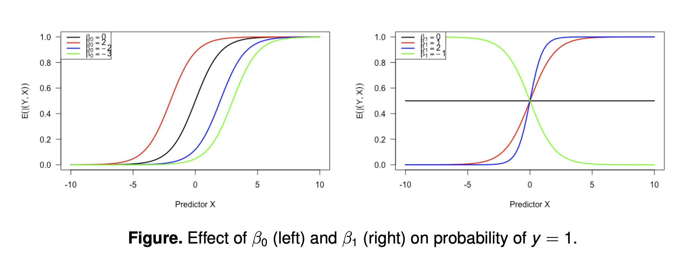{fig-align="center" width="60%"}

## Modeling binary data: different link functions

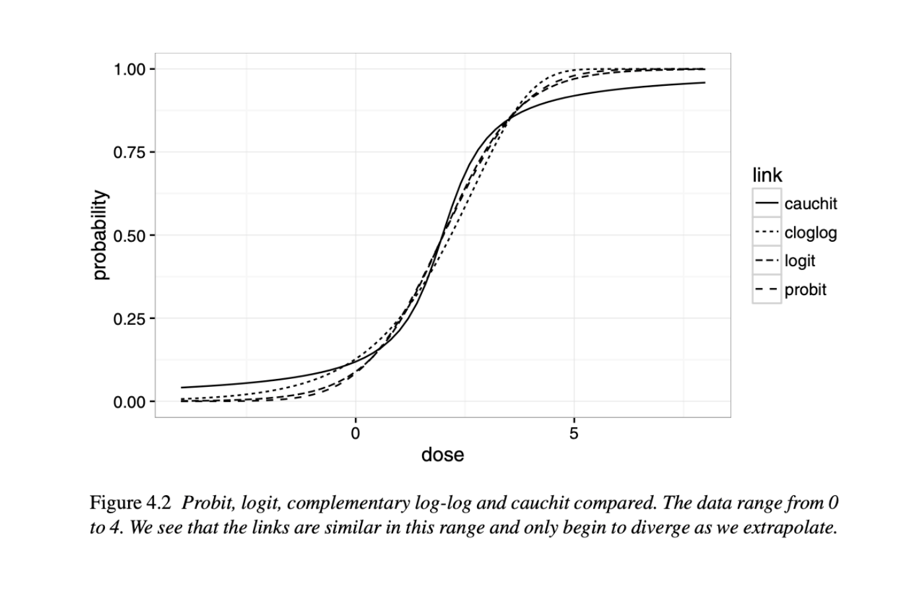{fig-align="center" width="60%"}

## Modeling count data: covariate effects

Consider another example: A hospital tracks the number of emergency room visits made by each individual in 2019 ($y_i$). How do age, sex, and chronic health conditions affect the number of visits?

:::{.fragment}
[Poisson regression]{.maroon} specifies

$$y_i\mid\mathbf{x}_i\sim\operatorname{Poisson}(\lambda_i),$$
$$\log(\lambda_i)=\mathbf{x}_i^T\boldsymbol\beta
\quad\Longrightarrow\quad
\lambda_i=\exp(\mathbf{x}_i^T\boldsymbol\beta).$$

- Covariate effects are [multiplicative]{.maroon} on the expected-count scale.
- Randomness comes from the Poisson distribution, without a separate additive $\epsilon_i$ term.
::: 

## Modeling count data: interpretation

When all non-intercept predictors equal zero, i.e. $x_i = 0$

$$\log(\lambda_i)=\beta_0\quad\Longrightarrow\quad \lambda_i=e^{\beta_0}.$$

:::{.fragment}
For a one-unit increase in $x$, holding other predictors fixed,

$$\log(\lambda_i)=\beta_0+x_i\beta_1,$$
$$\log(\lambda_i^*)=\beta_0+(x_i+1)\beta_1.$$
::: 

:::{.fragment}
Therefore,

$$\beta_1=\log\left(\frac{\lambda_i^*}{\lambda_i}\right),\qquad
 e^{\beta_1}=\frac{\lambda_i^*}{\lambda_i}.$$

[Interpretation of $e^{\beta_1}$]{.maroon} 

```{=html}
<textarea class="annotation-box"
          placeholder="Type notes here..."></textarea>
```
::: 

## Activity: What Does the Coefficient Mean?

A researcher fits the following two models.

:::: {.columns}
::: {.column width="50%"}

**Model 1: Predicting Hypertension**

$$
\log\left(\frac{p_i}{1-p_i}\right)
=
-2.1 + 0.35x_i,
$$

where $x$ is age measured in **decades**.

:::

::: {.column width="50%"}

**Model 2: Predicting Number of Migraines**

$$
\log(\lambda_i)
=
0.8 - 0.20z_i,
$$

where $z$ is hours of weekly physical activity.

:::
::::

**Discuss:**

1. Interpret $0.35$ and $e^{0.35}$ in Model 1.
2. Interpret $-0.20$ and $e^{-0.20}$ in Model 2.
3. Why would it be incorrect to say that a one-unit increase in $x$ increases the [probability]{.maroon} by $0.35$?

## Some considerations

1. Should we always use Bernoulli and Poisson models [just because]{.maroon} the response is binary or a non-negative integer?

  - Despite convenience in modeling, they are often restrictive in using [a single parameter]{.maroon} to specify means and variances.
    - What if $\text{Var}(y) \neq E(y)(1-E(y))$ in binary data and $\text{Var}(y) \neq E(y)$ in count data? 
    Often, there is an issue of [zero-inflatedness]{.maroon} in count modelling

:::{.fragment}
2. Is it reasonable to (always) specify canonical link functions as DGP?

  - For example, in practice, what should we choose between logit and probit link functions in logistic regression?
  
::: 

:::{.fragment}
In such cases, your model would be misspecified, [impacting statistical inference]{.maroon}
::: 

## Example 1: can we just fit linear regression?

:::: {.columns}
::: {.column width="50%"}
- Often, a linear trend is obvious when y is count data, but should we use $\exp({\boldsymbol{x_i}^\mathsf{T}\boldsymbol{\beta}})$, (e.g. Poisson)? 

<br> 

- Lessons from the previous lecture: is the [constant variance assumption]{.maroon} satisfied?

  - If not, what would be the impact to statistical inference when we fit linear regression?
:::

::: {.column width="50%"}
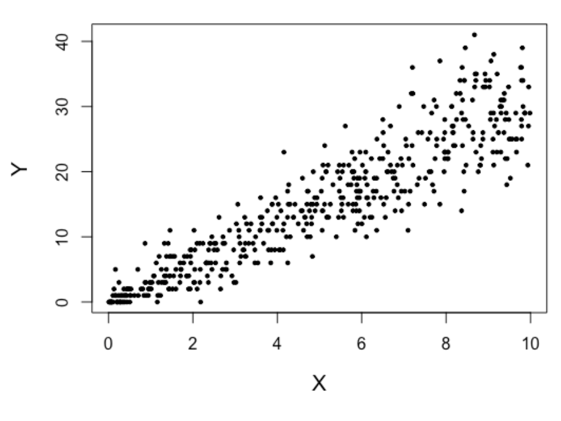{fig-align="center" width="100%"}
:::
::::

## Example 2: excess zeros in count data

A researcher asks how many cigarettes a participant smoked in the past week.

- A non-smoker should not have consumed any
- A smoker may also report zero that week.

:::{.fragment}
:::: {.columns}
::: {.column width="58%"}

<br> 

In such a case, a more flexible model would be in a more complicated form 

$$Y_i=\begin{cases}
=0,&\text{with probability }1-p,\\
\sim \text{Poisson}(\lambda) &\text{with probability }p.
\end{cases}$$

This is an example of the [Zero-Inflated Poisson (ZIP)]{.maroon} model.
:::
::: {.column width="42%"}
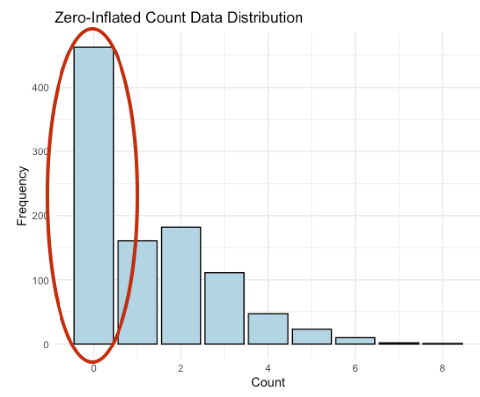{fig-align="center" width="100%"}
:::
::::
::: 

## Example 3: negative binomial counts

The [negative binomial]{.maroon} distribution can represent the number of failures before a target number of successes.

  - It generalizes the geometric distribution.
  - Mean and variance are specified by two parameters $\implies$ less restrictive than Poisson

$$E(Y)=\mu,\qquad \operatorname{Var}(Y)=\mu+\frac{\mu^2}{k}.$$

:::{.fragment}

```{webr}
set.seed(442)
x <- rnbinom(n = 10000, mu = 3, size = 2)
mean(x)  
var(x)   # can be different from mean(x)
```
::: 

## Poisson and negative binomial fits

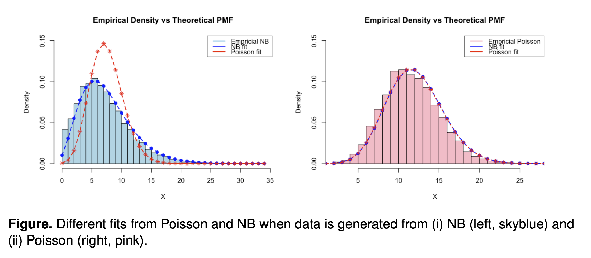{fig-align="center" width="60%"}

## Inflated Type I error?

:::: {.columns}
::: {.column width="50%"}
**Negative binomial data**

```{webr}
set.seed(0)
n <- 300
x <- rnorm(n)
p_values <- numeric(1000)
for (sim in seq_along(p_values)) {
  y <- rnbinom(n, mu = 3, size = 2)
  fit <- glm(y ~ x, family = poisson())
  p_values[sim] <- coef(summary(fit))[2, 4]
}
mean(p_values < 0.05)
```

:::
::: {.column width="50%"}
**Zero-inflated Poisson data**

```{webr}
set.seed(0)
n <- 300
x <- rnorm(n)
p_values <- numeric(1000)
for (sim in seq_along(p_values)) {
  z <- rbinom(n, 1, 0.3)
  y <- ifelse(z == 0, 0, rpois(n, 3))
  fit <- glm(y ~ x, family = poisson())
  p_values[sim] <- coef(summary(fit))[2, 4]
}
mean(p_values < 0.05)
```

:::
::::

## Inflated Type I error?

Let's see if asymptotics help. Repeat the previous simulations with $n=10000$. 

The code takes too long to run live, but when you run the code below, you will find that both Type 1 Errors are [still inflated]{.maroon}. 

:::: {.columns}
::: {.column width="50%"}
**Negative binomial data**

```R
set.seed(0)
n <- 10000
x <- rnorm(n)
p_values <- numeric(10000)
for (sim in seq_along(p_values)) {
  y <- rnbinom(n, mu = 3, size = 2)
  fit <- glm(y ~ x, family = poisson())
  p_values[sim] <- coef(summary(fit))[2, 4]
}
mean(p_values < 0.05) # 0.202 (still inflated)
```

:::
::: {.column width="50%"}
**Zero-inflated Poisson data**

```R
set.seed(0)
n <- 10000
x <- rnorm(n)
p_values <- numeric(10000)
for (sim in seq_along(p_values)) {
  z <- rbinom(n, 1, 0.3)
  y <- ifelse(z == 0, 0, rpois(n, 3))
  fit <- glm(y ~ x, family = poisson())
  p_values[sim] <- coef(summary(fit))[2, 4]
}
mean(p_values < 0.05) # 0.271 (still inflated)
```

:::
::::

The [variance assumption]{.maroon} remains wrong as $n$ increases. Model-based standard errors remain too small.

## The next two lectures

- Learn how GLMs are estimated and how inference is performed.
- Learn remedies when the distributional assumptions behind a GLM do not hold.

# Maximum likelihood and exponential family 

## Why maximum likelihood in GLMs?

- In the linear model with normality assumption, $\hat{\boldsymbol\beta}_{\mathrm{MLE}}=\hat{\boldsymbol\beta}_{\mathrm{LS}}$.

- Logistic and Poisson regression generally have no closed-form coefficient estimates.

- We estimate coefficients by [maximum likelihood]{.maroon}, using numerical optimization.

- Inference relies on MLE properties that hold [asymptotically]{.maroon}, under regularity conditions.

- These properties [do not guarantee good performance in small samples]{.maroon}.

## Maximum likelihood

[A quick review of the scalar parameter: $\theta$]{.maroon}.

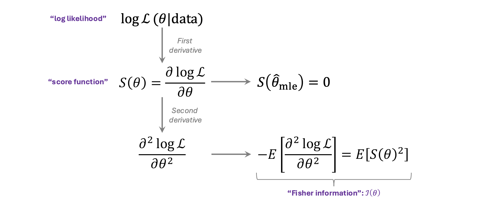{fig-align="center" width="80%"}

## Maximum likelihood: vector parameter

[A quick review of the vector parameter: $\boldsymbol{\theta}$]{.maroon}.

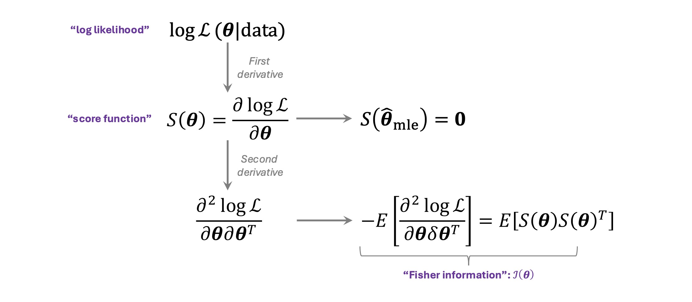{fig-align="center" width="80%"}

## Score and information identities

The score has an expected value of 0:

$$E[S(\theta)]=0.$$

:::{.fragment}
The Fisher information is defined by the variance of the score:

$$\mathcal I(\theta)=\operatorname{Var}[S(\theta)]
=E\left[\left(\frac{\partial\log L}{\partial\theta}\right)^2\right].$$

and, under some regularity conditions, it is also equivalent to:

$$\mathcal I(\theta)=-E\left[\frac{\partial^2\log L}{\partial\theta^2}\right].$$
::: 

## Why does the score have mean zero?

$$
\begin{aligned}
E[S(\theta)]
&=\int \frac{\partial}{\partial\theta}\log f(x;\theta)\,f(x;\theta)\,dx\\
&=\int \frac{1}{f(x;\theta)}\frac{\partial f(x;\theta)}{\partial\theta}f(x;\theta)\,dx\\
&=\int \frac{\partial f(x;\theta)}{\partial\theta}\,dx\\
&=\frac{\partial}{\partial\theta}\int f(x;\theta)\,dx\\
&=\frac{\partial}{\partial\theta}1=0.
\end{aligned}
$$

Regularity conditions allow us to interchange differentiation and integration.

## Why are the information expressions equal?

$E[S'(\theta)]=-E[S(\theta)^2]$ because 

$$
\begin{aligned}
0&=\frac{\partial}{\partial\theta}E[S(\theta)]\\
&=\int\frac{\partial}{\partial\theta}\{S(\theta)f(x;\theta)\}\,dx\\
&=\int S'(\theta)f(x;\theta)\,dx
+\int S(\theta)\frac{\partial f(x;\theta)}{\partial\theta}\,dx\\
&=E[S'(\theta)]+E[S(\theta)^2].
\end{aligned}
$$

:::{.fragment}
Note that we used

$$S(\theta)=\frac{\partial}{\partial\theta}\log (f(x;\theta))= \frac{1}{f(x;\theta)} \frac{\partial}{\partial\theta}f(x;\theta) \implies \frac{\partial}{\partial\theta}f(x;\theta)=S(\theta)f(x;\theta)$$
in the last equation above. 
::: 

## Properties of maximum likelihood estimators

- [Asymptotic normality]{.maroon}:

$$\hat{\boldsymbol\theta}_{\mathrm{MLE}}
\ \dot\sim\ N\left(\boldsymbol\theta,\mathcal I_n(\boldsymbol\theta)^{-1}\right).$$

<br> 

:::{.fragment}
- [Asymptotic efficiency]{.maroon}: $[\mathcal{I}(\theta)]^{-1}$ above achieves the [Cramér–Rao lower bound asymptotically]{.maroon} under regularity conditions, making it an [efficient]{.maroon} estimator for large samples.
::: 

<br> 

:::{.fragment}
- [Invariance]{.maroon}: for a one-to-one transformation $h$, the MLE of $h(\theta)$ is $h(\hat\theta)$.
:::

## Maximum likelihood example: median regression

:::: {.columns}
::: {.column width="65%"}
We consider a [median regression]{.maroon}, and formulate it with a Laplace distribution

$$f(y_i\mid\boldsymbol\beta,b)=\frac{1}{2b}
\exp\left(-\frac{|y_i-\mathbf x_i^T\boldsymbol\beta|}{b}\right).$$

:::{.fragment}
Then, for fixed $b$,

$$\ell(\boldsymbol\beta)=-\frac{1}{b}\sum_{i=1}^n
|y_i-\mathbf x_i^T\boldsymbol\beta|+C.$$

Maximizing likelihood is equivalent to minimizing the sum of absolute deviations.
::: 

:::
::: {.column width="35%"}
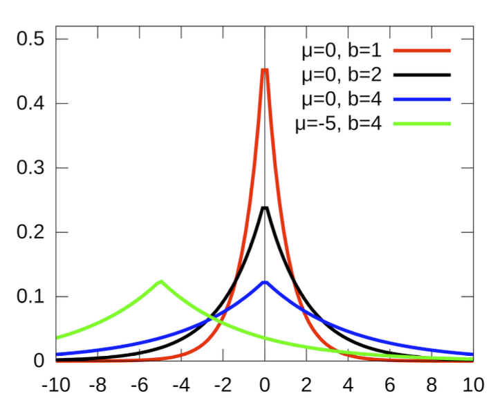{fig-align="center" width="100%"}
:::
::::

:::{.fragment}
Under this Laplace model, median regression is more efficient than least squares asymptotically.
::: 

## Exponential family

The observed values are assumed to be independent and to have come from a distribution in the [exponential family]{.maroon}.

<br> 

:::{.fragment}
The exponential family is characterized by a pmf or pdf of the (simplified) form:

$$f(y\mid\theta,\phi)=\exp\left\{\frac{y\theta-b(\theta)}{\phi}+c(y,\phi)\right\}.$$

- $\theta$: natural (canonical) parameter.
- $\phi$: dispersion parameter.
- Normal, Bernoulli, Poisson, and Gamma distributions belong to this family.
- This framework unifies the theory behind GLMs.
::: 

## Exponential family: normal distribution

We show that the normal distribution is part of the exponential family.  

$$
\begin{aligned}
f(y\mid\mu,\sigma^2)
&=\frac{1}{\sqrt{2\pi\sigma^2}}\exp\left[-\frac{(y-\mu)^2}{2\sigma^2}\right]\\
&=\exp\left\{\frac{y\mu-\mu^2/2}{\sigma^2}
-\frac{y^2}{2\sigma^2}-\frac12\log(2\pi\sigma^2)\right\}.
\end{aligned}
$$

<br> 

:::{.fragment}
Therefore,

$$\theta=\mu,\qquad \phi=\sigma^2,\qquad b(\theta)=\frac{\theta^2}{2},$$
$$c(y,\phi)=-\frac{y^2}{2\phi}-\frac12\log(2\pi\phi).$$
:::

## Exponential family: Bernoulli distribution

We show that the Bernoulli distribution is part of the exponential family. 

$$
\begin{aligned}
f(y\mid\mu)&=\mu^y(1-\mu)^{1-y}\\
&=\exp\left\{y\log\left(\frac{\mu}{1-\mu}\right)+\log(1-\mu)\right\}.
\end{aligned}
$$

:::{.fragment}
Therefore,

$$\theta=\log\left(\frac{\mu}{1-\mu}\right),\qquad \phi=1,$$
$$b(\theta)=\log(1+e^\theta)=-\log(1-\mu),\qquad c(y,\phi)=0.$$
:::

## Exponential family

We have the following known properties of the exponential family that come from maximum likelihood. 

1. $E[\partial \log \mathcal{L}/\partial\theta]=0$ implies that

$$E\left[\frac{y-b'(\theta)}{\phi}\right]=0 \implies E[y]=b'(\theta)$$

:::{.fragment}
2. $E[\partial^2 \log \mathcal{L}/\partial\theta^2]=-E[(\partial \log \mathcal{L}/\partial\theta)^2]$ implies that

$$-E\left[\frac{\partial^2\ell}{\partial\theta^2}\right]
=\frac{b''(\theta)}{\phi}
=E\left[\left(\frac{Y-b'(\theta)}{\phi^2}\right)^2\right].$$

which leads to

$$\operatorname{Var}(Y)=\phi b''(\theta).$$
::: 

## Link and variance functions

A [canonical link]{.maroon} makes the linear predictor equal to the natural parameter:

$$\eta=g(\mu)=\theta.$$

- Canonical links are one possible choice.
- Bernoulli alternatives include probit and complementary log-log.

<br> 

:::{.fragment}
The [variance function]{.maroon} satisfies

$$\operatorname{Var}(Y)=\phi v(\mu),\qquad v(\mu)=b''(\theta).$$
::: 

## Exponential family: summary

<br> 
<br> 

| Distribution | Canonical link $g(\mu)$ | Mean under canonical link | $v(\mu)$ | $\phi$ |
|---|---|---|---|---|
| Normal | $\mu$ | $\eta$ | $1$ | $\sigma^2$ |
| Bernoulli | $\log\{\mu/(1-\mu)\}$ | $e^\eta/(1+e^\eta)$ | $\mu(1-\mu)$ | $1$ |
| Poisson | $\log\mu$ | $e^\eta$ | $\mu$ | $1$ |
| Exponential | $-1/\mu$ | $-1/\eta$, $\eta<0$ | $\mu^2$ | $1$ |

<br> 
<br> 

Here $\eta=\mathbf x_i^T\boldsymbol\beta$.

## Study tips

Become familiar with the roles and relationships of

$$g(\cdot),\quad v(\cdot),\quad b(\cdot),\quad\phi,\quad\mu,\quad\theta,\quad\eta.$$

Review differentiation rules, especially the [chain rule]{.maroon}.

# Parameter estimation in GLMs

## Review: three components of a GLM

For independent responses $y_i$ and covariates $\mathbf x_i$, the data-generating process for $y_i$ has the following specification:

1. [Random component]{.maroon}: $y_i$ is assumed to follow a distribution that belongs to the exponential family.
2. [Systematic component]{.maroon}: given covariates $\mathbf x_i$, the mean of $y_i$ can be expressed in terms of the following lienar combination of predictors

$$\eta_i=\mathbf x_i^T\boldsymbol\beta.$$

3. [Link function]{.maroon}: relates the linear combination of predictors with the transformed mean response

$$g(\mu_i)=\eta_i,\quad \text{where} \quad \mu_i=E(y_i).$$

## Review: examples of GLM specifications

Assume responses are conditionally independent.

  - Logistic regression with a **logit** link:

$$y_i\sim\operatorname{Bernoulli}\left(\frac{e^{\mathbf x_i^T\boldsymbol\beta}}{1+e^{\mathbf x_i^T\boldsymbol\beta}}\right).$$

  - Logistic regression with a **probit** link, where $\Phi(\cdot)$  is a CDF function of $\mathcal{N}(0,1)$

$$y_i\sim\operatorname{Bernoulli}\left(\Phi(\mathbf x_i^T\boldsymbol\beta)\right).$$

- Poisson with a **log** link: 

$$y_i\sim\operatorname{Poisson}(e^{\mathbf x_i^T\boldsymbol\beta})$$.

- Poisson with an **identity** link (when $\mathbf x_i^T\boldsymbol\beta > 0$ is always satisfied): 

$$y_i\sim\operatorname{Poisson}(\mathbf x_i^T\boldsymbol\beta)$$

## Activity: Build the GLM

Suppose

$$
y_i\sim\operatorname{Bernoulli}(\mu_i),
\qquad
\log\left(\frac{\mu_i}{1-\mu_i}\right)
=
\beta_0+\beta_1x_i.
$$

Identify

:::: {.columns}
::: {.column width="50%"}

1. The [random component]{.maroon}
2. The [systematic component]{.maroon}
3. The [link function]{.maroon}
4. The inverse link, $g^{-1}(\eta)$

:::

::: {.column width="50%"}

5. The variance function, $v(\mu)$
6. The derivative, $g'(\mu)$
7. Which quantities vary across observations?

:::
::::

<br> 

**Question:** Why might solving for $\boldsymbol\beta$ require an [iterative algorithm]{.maroon}?

## Fitting GLMs in R

Specify the response, predictors, family, and link in `glm()`.

  - [linear components]{.maroon}: what is the response, what is the covariate? 
  - [random component]{.maroon} and [link functions]{.maroon} could be specified as follows:

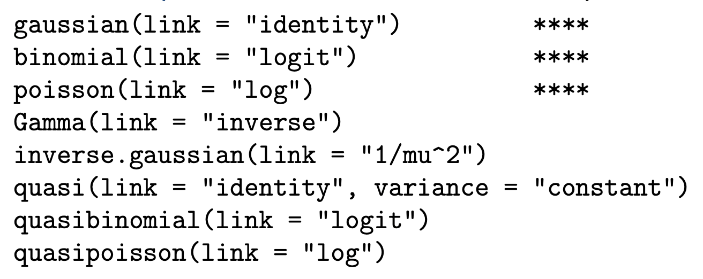{fig-align="center" width="50%"}

:::{.fragment}
How important is the choice of link?

  - If we care about [inference]{.maroon}, choosing the wrong link function can be catastrophic.
  - If we care only about [prediction]{.maroon}, the choice of link function does not matter much.
  
::: 

## GLM: maximizing the log-likelihood

Derivative of log-likelihood equals to 0: 

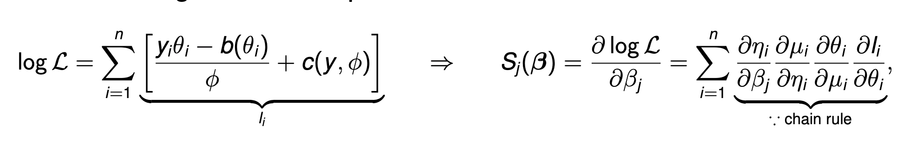{fig-align="center" width="100%"}

where 

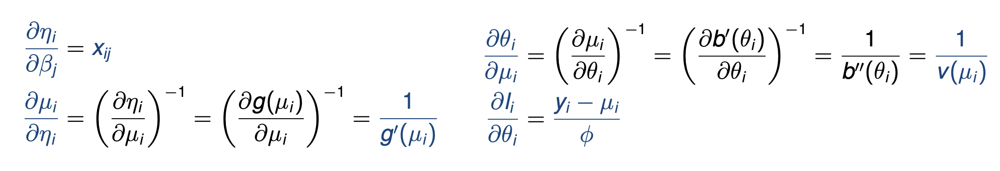{fig-align="center" width="100%"}

## GLM: a weighted least squares equation

Combining all together: 

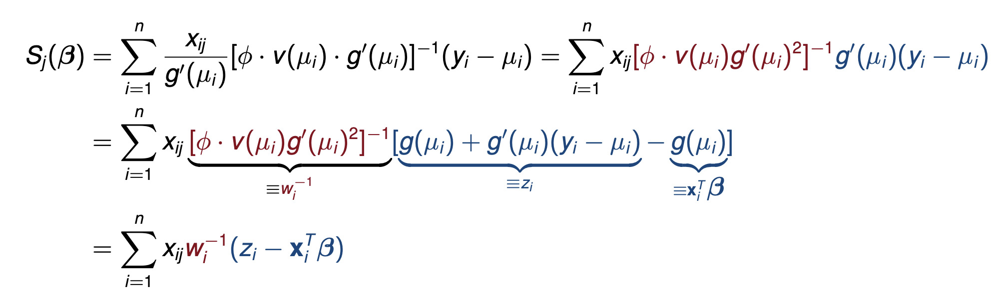{fig-align="center" width="100%"} 

:::{.fragment}
Making the above a matrix form and setting it equal to 0, 

$$
\boldsymbol X^T\boldsymbol W^{-1}(\boldsymbol z - \boldsymbol X^T\boldsymbol \beta)=0 \quad \text{with} \quad \boldsymbol W = \text{diag}\{(\phi\cdot v(\mu_i)g'(\mu_i)^2)\}
$$

which becomes a [weighted least squares]{.maroon} problem.
::: 

## Understanding $g(\mu_i)+g'(\mu_i)(y_i-\mu_i)$

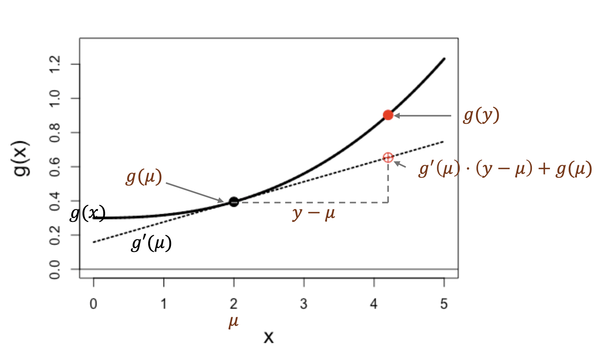{fig-align="center" width="80%"}
<br> 

**Note:** $z_i$ is a first-order Taylor approximation of $g(y_i)$ using $\mu_i$. 

## Iteratively reweighted least squares

:::{.algorithm-box}

**IRLS Algorithm**

1. Initialize $\hat\eta_i$ (Typically, fit a linear regression).
    
2. Repeat the following until convergence:

$$\hat\mu_i\leftarrow g^{-1}(\hat\eta_i),$$
$$\hat z_i\leftarrow\hat\eta_i+(y_i-\hat\mu_i)g'(\hat\mu_i),$$
$$\hat w_i\leftarrow\phi v(\hat\mu_i)[g'(\hat\mu_i)]^2,$$
$$\hat{\boldsymbol\beta}\leftarrow
(X^T\hat W^{-1}X)^{-1}X^T\hat W^{-1}\hat{\mathbf z},$$
$$\hat{\boldsymbol\eta}\leftarrow X\hat{\boldsymbol\beta}.$$
:::

Both the working response ($\hat z_i$) and weights ($\hat w_i$) are updated each iteration.

## Logistic IRLS: implementation in R

```{webr}
myLogistic <- function(y, x, n_iter = 20) {
  eta <- rep(qlogis(mean(y)), length(y))
  for (iter in seq_len(n_iter)) {
    mu <- plogis(eta)
    z <- eta + (y - mu) / (mu * (1 - mu))
    w <- 1 / (mu * (1 - mu))
    fit <- lm(z ~ x, weights = 1 / w)
    eta <- fitted(fit)
  }
  mu <- plogis(eta)
  list(beta = coef(fit), wts = 1 / (mu * (1 - mu)))
}


set.seed(442)
n <- 50
x <- rnorm(n)
y <- rbinom(n, 1, plogis(0.5 + 0.2 * x))
fit_my <- myLogistic(y, x)
fit_glm <- glm(y ~ x, family = binomial())
fit_my$beta
coef(fit_glm)
```


## Uncertainty Quantification

The score function is expressed by

$$\mathbf S(\boldsymbol\beta)=\sum_{i=1}^n
\frac{\partial\mu_i}{\partial\boldsymbol\beta}
\frac{y_i-\mu_i}{\phi v(\mu_i)}.$$

:::{.fragment}
The Fisher information matrix is

$$
\begin{aligned}
\mathcal I(\boldsymbol\beta)
&=\sum_{i=1}^n\frac{1}{\phi v(\mu_i)}
\frac{\partial\mu_i}{\partial\boldsymbol\beta}
\left(\frac{\partial\mu_i}{\partial\boldsymbol\beta}\right)^T\\
&=\sum_{i=1}^n\mathbf x_i
\{\phi v(\mu_i)[g'(\mu_i)]^2\}^{-1}\mathbf x_i^T\\
&=X^TW^{-1}X.
\end{aligned}
$$
::: 

## Uncertainty Quantification

Under regularity conditions, $\hat{\boldsymbol\beta}$ is approximately normal:

$$\hat{\boldsymbol\beta}\ \dot\sim\ N\left(\boldsymbol\beta,
\mathcal I(\boldsymbol\beta)^{-1}\right).$$

:::{.fragment}
Its asymptotic covariance is

$$\operatorname{aVar}(\hat{\boldsymbol\beta})=(X^TW^{-1}X)^{-1}.$$
::: 

:::{.fragment}
Since $\boldsymbol W$ consists of unknown parameters, we replace $\boldsymbol \beta$ with $\boldsymbol{\hat{\beta}}_{MLE}$ to be used in statistical inference ($\boldsymbol{\hat{W}}$)
::: 

## GLM uncertainty: implementation in R

```{webr}
summary(fit_glm) 

vcov(fit_glm)

X = cbind(1,x)
solve(t(X)%*%diag(1/fit_my$wts)%*%X) # Manual implementation of Cov(beta.hat)
```


# Statistical inference in GLMs 

## Hypothesis Testing 1: Likelihood ratio test

<br> 

$$
H_0:\underbrace{\beta_1 = \cdots = \beta_p = 0}_{\text{i.e., } \mu_i = \mu}
$$
Procedure: 

1. Fit the null model and obtain $\ell(\hat{\boldsymbol\mu}_{\mathrm{null}})$.
2. Fit the full model and obtain $\ell(\hat{\boldsymbol\mu}_{\mathrm{full}})$.
3. Construct the [likelihood ratio statistic]{.maroon}:

$$T_{\mathrm{LRT}}=-2[\ell(\hat{\boldsymbol\beta}_{\mathrm{full}})
-\ell(\hat{\boldsymbol\beta}_{\mathrm{null}})].$$
4. $T_{\mathrm{LRT}}\ \dot\sim\ \chi_p^2$ [asymptotically (i.e. as $n \rightarrow 0$)]{.maroon} when the null hypothesis is true

## Hypothesis Testing 1: Likelihood ratio test

:::: {.columns}
::: {.column width="53%"}
```R
n <- 20
p_values <- numeric(10000)
for (sim in seq_along(p_values)) {
  x1 <- rnorm(n)
  x2 <- runif(n)
  y <- rbinom(n, 1, 0.3)
  fit0 <- glm(y ~ 1, family = binomial())
  fit1 <- glm(y ~ x1 + x2,
              family = binomial())
  stat <- 2 * as.numeric(
    logLik(fit1) - logLik(fit0))
  p_values[sim] <- pchisq(stat, df = 2,
                         lower.tail = FALSE)
}
```
:::
::: {.column width="47%"}
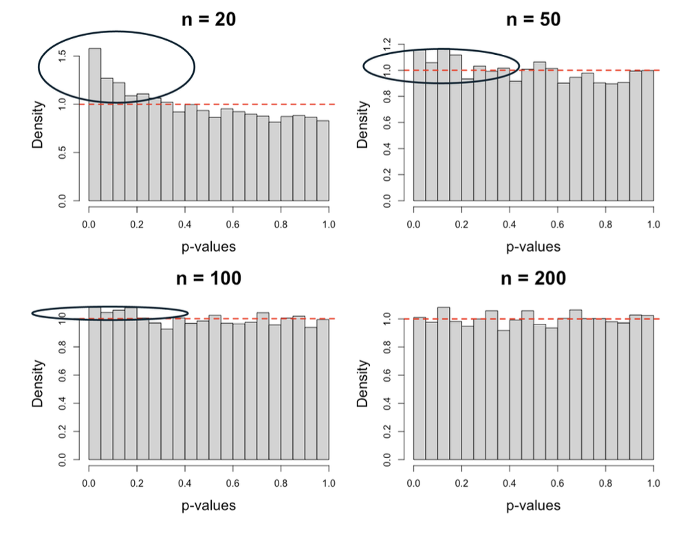{fig-align="center" width="100%"}
:::
::::


## Hypothesis Testing 2: Wald Test

<br> 

$$
H_0:\underbrace{\beta_1 = \cdots = \beta_p = 0}_{\text{i.e., } \mu_i = \mu}
$$

Procedure:

1. Estimate $\hat{\beta}_{1:p}$ using MLE 
2. Obtain $\widehat{Var}(\hat{\beta}_{1:p})$, denoted by $\hat\Sigma_{1:p}$. 
3. Construct the [Wald statistic]{.maroon}  
$$T_{\mathrm{Wald}}=\hat{\boldsymbol\beta}_{1:p}^T
\hat\Sigma_{1:p}^{-1}\hat{\boldsymbol\beta}_{1:p}.$$
4. $T_{\mathrm{Wald}}\ \dot\sim\ \chi_p^2$ [asymptotically (i.e. as $n \rightarrow 0$)]{.maroon} when the null hypothesis is true.

:::{.fragment}
The Wald test requires fitting a full model. 

Wald and likelihood ratio tests are [asymptotically equivalent]{.maroon} under the usual regularity conditions, but can behave differently in small samples.
::: 

## Hypothesis Testing 2: Wald Test

:::: {.columns}
::: {.column width="53%"}
```R
n <- 20
p_values <- numeric(10000)
for (sim in seq_along(p_values)) {
  x1 <- rnorm(n)
  x2 <- runif(n)
  y <- rbinom(n, 1, 0.3)
  fit <- glm(y ~ x1 + x2,
             family = binomial())
  b <- coef(fit)[2:3]
  V <- vcov(fit)[2:3, 2:3]
  stat <- as.numeric(t(b) %*% solve(V, b))
  p_values[sim] <- pchisq(stat, df = 2,
                         lower.tail = FALSE)
}
```
:::
::: {.column width="47%"}
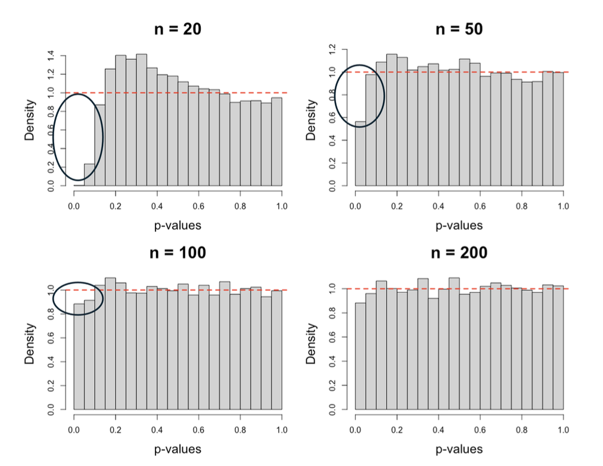{fig-align="center" width="100%"}
:::
::::

# Checking assumptions

## Residuals to check assumptions

In linear regression, residuals help assess assumptions related to $\epsilon_i$s

<br> 

:::{.fragment}
In non-Gaussian GLMs, what specific assumptions are we assessing? 
  
  - we don't have such $\epsilon$ terms in logistic/Poisson GLMs
  
::: 

:::{.fragment}
The distributional assumptions could be checked indirectly by studying the mean-variance relationship because 
  
  - in logistic regression: $Var(y_i) = \mu_i(1-\mu_i)$ 
  - in Poisson regression: $Var(y_i) = \mu_i$

Still, we need to define a good [residual term]{.maroon} for GLM so that we can evaluate such assumptions. 
::: 


## Residuals

[Pearson ('standardized') residuals]{.maroon}:

$$r_i^P=\frac{y_i-\hat\mu_i}{\sqrt{v(\hat\mu_i)}}.$$

[Deviance residuals]{.maroon}:

$$r_i^D=\operatorname{sign}(y_i-\hat\mu_i)
\sqrt{2\{\ell_i(y_i)-\ell_i(\hat\mu_i)\}}.$$
 
<br> 

  - Here, $\ell_i(y_i)$ is the log likelihood from the saturated model (i.e. a hypothetical model that perfectly fits the data so that $\hat{\mu}_i = y_i$)
  - $\ell_i(\hat\mu_i)$ is the log likelihood from the fitted model


## Residuals: Poisson example

For a fitted Poisson regression,

$$r_i^P=\frac{y_i-\hat\mu_i}{\sqrt{\hat\mu_i}}.$$

<br> 

The deviance residual is

$$r_i^D=\operatorname{sign}(y_i-\hat\mu_i)
\sqrt{2\left[y_i\log\left(\frac{y_i}{\hat\mu_i}\right)-(y_i-\hat\mu_i)\right]}.$$


## Checking 'Linearity'

:::: {.columns}
::: {.column width="60%"}

<br> 
<br> 

We can look at the scatterplot between the deviance residuals and $\mathbf x_i^T\hat{\boldsymbol\beta}$ to check if there is any non-linear pattern.

:::
::: {.column width="40%"}
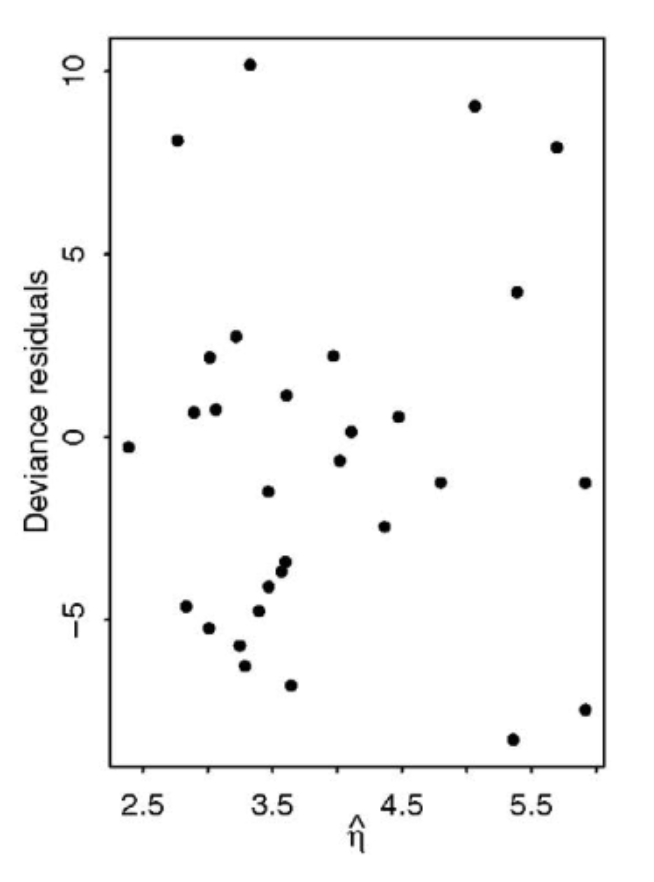{fig-align="center" width="100%"}
:::
::::

## Checking overdispersion and underdispersion

:::: {.columns}
::: {.column width="60%"}
The assumed distribution imposes a mean–variance relationship, so we may perform exploratory analyses to understand [overdispersion]{.maroon}. 

<br> 

Overdispersion is when the data has more variance than the statistical model expects it to have.

<br> 

For example, in Poisson, $\hat\mu_i$ and $(y_i-\hat\mu_i)^2$ characterize the mean and variance. We plot both to compare and look to see if the points are randomly scattered around the 45-degree line.

:::
::: {.column width="40%"}
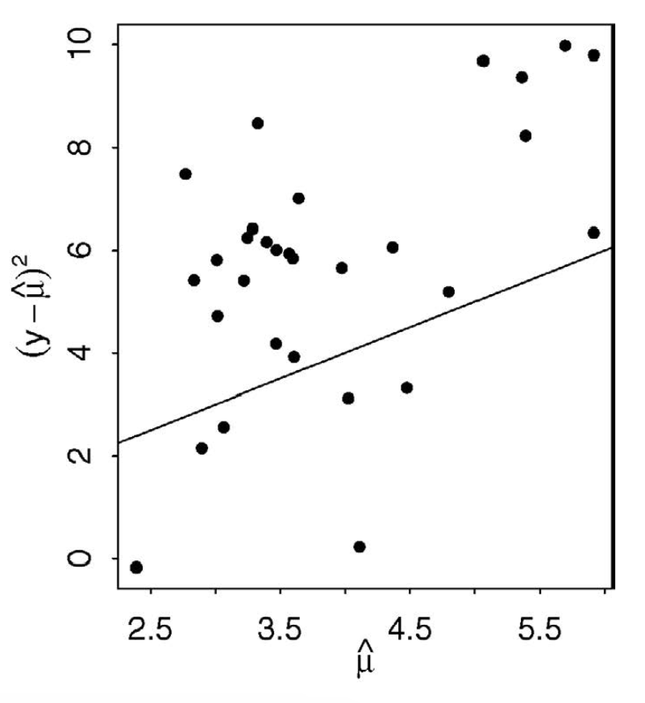{fig-align="center" width="100%"}
:::
::::


## Checking Goodness of fit

Two useful summaries are
  
  - Deviance: $D=\sum_{i=1}^n(r_i^D)^2$, 
  - Pearson $X^2$ statistic: $X^2=\sum_{i=1}^n(r_i^P)^2$

<br> 

:::{.fragment}
Both $D$ and $X^2$ follow $\chi^2_{n-p-1}$ asymptotically [when the mean-variance relationship imposed in your DGP is met]{.maroon}.

  - If  $D$ or $X^2$ is significantly larger than $n-p-1$, it suggests a possible [overdispersion]{.maroon} 
  - If  $D$ or $X^2$ is significantly less than $n-p-1$, it suggests a possible [underdispersion]{.maroon}
  
::: 

# Modeling considerations 

## Modeling Considerations

Recall the motivating question at the start of last lecture: [Should we use logistic or Poisson regression just because the data type is binary or count?]{.maroon} 

<br> 

:::{.fragment}
Strong distributional assumptions (in variance) specifying expected value and variance

  - Bernoulli: $\operatorname{Var}(Y\mid X)=\mu(1-\mu)$.
  - Poisson: $\operatorname{Var}(Y\mid X)=\mu$.

**Note**: When using the normal distribution, there are two separate parameters for the mean and variance.
::: 

<br> 

:::{.fragment}
We may perform exploratory data analysis to check if this assumption is true.
::: 

## Separation

One problem we might face when fitting a logistic regression model is [separation]{.maroon}.

[Complete separation]{.maroon} occurs when a predictor, or combination of predictors, perfectly separates the two outcome classes.

For example:

  - All observations with \(x < 5\) have \(Y=0\)
  - All observations with \(x > 5\) have \(Y=1\)

<br>

In this case, the likelihood keeps increasing as the magnitude of the coefficient increases:

$$
|\hat{\beta}_1| \rightarrow \infty.
$$

Therefore, there is **no finite MLE** for $$\beta_1$$.

## Separation 

**What might we see in practice?**

- Extremely large coefficient estimates
- Extremely large standard errors
- Convergence warnings in R
- Fitted probabilities very close to 0 or 1

<br> 

**What do we do?**

  - [DO NOT]{.maroon} just interpret the huge coefficient 
  
    - Under separation, the issue is not simply bias: the usual finite maximum likelihood estimate does not exist.
  
  - Use a method that stabilizes the estimate 
    
    - penalized logistic regression
    - Firth logistic regression

## Over/Underdispersion

[Quantifying goodness of fit]{.maroon} 

<br> 

From the exponential family, it is shown that 

$$\operatorname{Var}(y_i)=\phi v(\mu_i) \implies \phi = \frac{\operatorname{Var}(y_i)}{v(\mu)}.$$
where $\phi = 1$ in the Bernoulli or Poisson case. 

:::{.fragment}
We may estimate the [dispersion parameter, $\phi$,]{.maroon} by using the $X^2$ statistic because

$$
\frac{X^2}{\phi} \sim \chi^2_{n-p-1} \implies 
\mathbb{E}\left[\frac{X^2}{n-p-1}\right] = \phi \implies 
\hat\phi=\frac{X^2}{n-p-1}
$$

  - $\hat\phi\gg1$: suggests strong evidence of [overdispersion]{.maroon}
  - $\hat\phi\ll1$: suggests strong evidence of [underdispersion]{.maroon}
  - $\hat\phi\approx1$: broadly consistent with its variance assumption.
  
::: 

## Over/Underdispersion

[Quantifying goodness of fit]{.maroon}

<br> 

```{webr}
set.seed(0)
n <- 300
x <- rnorm(n)
y <- rnbinom(n, mu = 3, size = 2)
fit <- glm(y ~ x, family = poisson())
sum(residuals(fit, type = "pearson")^2) / df.residual(fit)

set.seed(0)
x <- rnorm(n)
y <- rpois(n, lambda = 3)
fit <- glm(y ~ x, family = poisson())
sum(residuals(fit, type = "pearson")^2) / df.residual(fit)
```

## Dispersion: impact on inference

With [overdispersion]{.maroon}:

  - The actual variance of data is greater than your modeled (assumed) variance
  - It means that the your model underestimates the true variance of parameter estimates
  - Your test statistic takes variance of parameter estimates as a denominator, which implies that the test statistic will be greater than what it should be
  - It eventually leads to inflation in Type 1 error.

<br> 

:::{.fragment}
Similarly, your Type 1 error would be overly conservative when [underdispersion]{.maroon} occurs. 
  
  - But it is ‘okay’ in preventing inflated T1E.
  - That’s one of the reasons that underdispersion is considered less serious than overdispersion
  
::: 

## Overdispersion: remedies

1. Use a more flexible DGP (i.e. where mean and variance are specified by two parameters).

   - Grouped binary counts: [beta-binomial]{.maroon} distribution.
   - Counts: [negative binomial]{.maroon} distribution, for example `MASS::glm.nb()`.

:::{.fragment}
2. Use [quasi-likelihood]{.maroon} with an adjusted variance.

  - The variance of $\boldsymbol{\hat{\beta}}$ is $\boldsymbol X^T\boldsymbol W\boldsymbol X$, with $\phi = 1$ in logistic and Poisson GLM 
  - We know that $\hat\phi > 1$ when overdispersion occurs 
  - [Key Idea]{.maroon}: the variance of $\boldsymbol{\hat{\beta}}$ is replaced by $\hat\phi \cdot (\boldsymbol X^T\boldsymbol W\boldsymbol X)$ with $\hat\phi$ estimated from the GLM fit (Pearson $X^2 statistic$)
  - [Does not change any $\boldsymbol{\hat{\beta}}$, but provides a more robust variance estimate.]{.maroon} 
  
      - Aims to prevent inflated T1E
      
:::

::: {.slide-footnote}
In R: `quasipoisson(link = "log")` or `quasibinomial(link = "logit")` in `glm()` to implement Quasi-likelihood.
:::

## More on quasi-likelihood

- Quasi-likelihood [does not]{.maroon} characterize any specific data-generating process.

<br> 

- Therefore, you cannot use Likelihood Ratio Test with quasi-poisson or quasi-binomial models (because there is no such likelihood). 

<br> 

- Welcome to [robust inference!]{.maroon}

  - M-estimation
  - Sandwich covariance estimators
  - Generalized estimating equations (GEE)
  - Generalized method of moments (GMM)

::: {.slide-footnote}
Lars Peter Hansen received the 2013 Nobel Prize in Economics for contributions including GMM.
:::

## Summary

- [Generalized linear models]{.maroon} extend linear regression to responses such as binary and count data by specifying a response distribution, a linear predictor, and a link function.

- GLM coefficients are typically estimated by [maximum likelihood]{.maroon}, often using an iterative procedure such as iteratively reweighted least squares.

- Statistical inference in GLMs relies largely on [asymptotic results]{.maroon}; Wald tests and likelihood ratio tests can be used to assess covariate effects.

- Model checking requires assessing both the [mean structure]{.maroon} and the distributional mean–variance relationship using residuals and goodness-of-fit measures.

- When assumptions such as the Poisson variance relationship are violated, alternatives such as [negative binomial models, zero-inflated models, or quasi-likelihood]{.maroon} may provide more appropriate modelling or inference.

**Announcements**: Next week is the midterm (Friday, October 23rd) in room FE 230 from 2:10pm -- 4:10pm
  
