## Review: Case Study

Researchers measure 40 different outcomes in a wellness intervention. They report that 3 outcomes are statistically significant at $p<0.05$, and conclude that the intervention is effective. They do not mention any adjustment for multiple testing.

<br> 

In a follow-up analysis, they apply Bonferroni correction and none of the outcomes remain significant. Another researcher argues that Bonferroni is “too conservative” and that FDR control would be more appropriate.

<br> 
<br> 

:::{.fragment} 
  1. What concerns do you have with the original analysis? 
  
  2. What information would you want before deciding how to adjust for multiple testing? 
  
  3. Do you agree that FDR is automatically “better” because it gives more discoveries? Why or why not?
:::

## Topics for the Next Two Weeks 

1. Review of estimators
2. Review of correlation and simple linear regression
3. Least squares
4. Construction of $t$ and $F$ tests 
5. Assumptions on linear models and violations
6. Weighted least squares (WLS)
7. Modeling considerations
8. Model selection

# Review of Estimators

## Estimation

Suppose that

$$
y_1,\ldots,y_n \overset{\text{i.i.d.}}{\sim} N(\mu,\sigma^2).
$$

We often use the sample mean to estimate $\mu:\widehat\mu=\frac{1}{n}\sum_{i=1}^n y_i.$.

<br>

:::{.fragment}
Why not use another estimator?

- $\widehat\mu_2=y_1$
- $\widehat\mu_3=1/n+\bar y$
- $\widehat\mu_4=\dfrac{\sum_{i=1}^n w_i y_i}{\sum_{i=1}^n w_i}$ for $w_i>0$

<br> 

Is there a setting in which $\widehat\mu_4$ is better than the others?
:::

## Expected Value of an Estimator

$$
\begin{aligned}
E[\widehat\mu]
&=E\left[\frac{1}{n}\sum_{i=1}^n y_i\right]
=\frac{1}{n}\sum_{i=1}^n E[y_i]
=\mu,\\[0.4em]
E[\widehat\mu_2]&=E[y_1]=\mu,\\[0.4em]
E[\widehat\mu_3]&=E\left[\frac{1}{n}+\bar y\right]=\frac{1}{n}+\mu,\\[0.4em]
E[\widehat\mu_4]
&=E\left[\frac{\sum_{i=1}^n w_i y_i}{\sum_{i=1}^n w_i}\right]
=\frac{\sum_{i=1}^n w_i\mu}{\sum_{i=1}^n w_i}
=\mu.
\end{aligned}
$$

$\widehat\mu_3$ is [biased]{style="color: maroon;"}. However, its bias approaches zero as $n\to\infty$.

## Variance of an Estimator

$$
\begin{aligned}
\operatorname{Var}(\widehat\mu)&=\frac{\sigma^2}{n},\\
\operatorname{Var}(\widehat\mu_2)&=\sigma^2,\\
\operatorname{Var}(\widehat\mu_3)&=\frac{\sigma^2}{n},\\
\operatorname{Var}(\widehat\mu_4)
&=\frac{\sum_{i=1}^n w_i^2}{\left(\sum_{i=1}^n w_i\right)^2}\sigma^2
\geq \frac{\sigma^2}{n}.
\end{aligned}
$$

The unweighted sample mean has the [lowest variance]{style="color: maroon;"} among the unbiased estimators $\widehat\mu$, $\widehat\mu_2$, and $\widehat\mu_4$.

## The Goal of Estimation

- This lecture focuses on finding an [unbiased estimator with the lowest variance]{style="color: maroon;"}.
  - Connections to statistical inference: Lower variance generally leads to higher statistical power.

:::{.fragment}
- If we restrict attention to linear estimators of the form $\widehat\theta=A\mathbf y$, this is equivalent to finding the [**Best Linear Unbiased Estimator (BLUE)**]{style="color: maroon;"}.
::: 

<br> 

:::{.fragment}
Later in the course:

1. We will include estimators whose bias approaches zero as $n\to\infty$, such as maximum likelihood estimators.
2. If inference is not the main objective, we may use

$$
\operatorname{Bias}(\widehat\theta)^2+\operatorname{Var}(\widehat\theta),
$$

which is the mean squared error.
::: 

# Correlation and Simple Linear Regression

## Correlation: Review

Pearson correlation measures [linear dependence]{style="color: maroon;"} between two random variables.

$$
\rho_{XY}
=\frac{\operatorname{Cov}(X,Y)}
{\sqrt{\operatorname{Var}(X)\operatorname{Var}(Y)}}
=E\left[
\frac{X-E(X)}{\sqrt{\operatorname{Var}(X)}}
\frac{Y-E(Y)}{\sqrt{\operatorname{Var}(Y)}}
\right].
$$

:::{.fragment}
**Notes:**

- $\rho_{XY}=0$ implies that $X$ and $Y$ are [uncorrelated]{style="color: maroon;"}.
- In the special case where $(X,Y)$ follows a multivariate normal distribution, $\rho_{XY}=0$ implies [independence]{style="color: maroon;"}.
::: 

## Sample Correlation

Given data $\{(x_i,y_i):i=1,\ldots,n\}$, estimate $\rho_{XY}$ using

$$
\widehat\rho_{XY}
=\frac{1}{n-1}\sum_{i=1}^n
\left(\frac{x_i-\bar x}{s_x}\right)
\left(\frac{y_i-\bar y}{s_y}\right).
$$

<br> 

:::{.fragment}
To test $H_0:\rho_{XY}=0$, construct

$$
T=\widehat\rho_{XY}
\sqrt{\frac{n-2}{1-\widehat\rho_{XY}^2}}
\sim t_{n-2}
$$

when $H_0$ is true.
::: 

## Correlation in R

:::: {.columns}

::: {.column width="48%"}
```{webr}
## Using built-in functions
set.seed(442)
x <- rnorm(n = 50)
y <- rnorm(n = 50)

cor.test(x, y)
```
:::

::: {.column width="52%"}
```{webr}
## Manual Implementation
x_scaled <- (x - mean(x)) / sd(x)
y_scaled <- (y - mean(y)) / sd(y)

rho_hat <- sum(x_scaled * y_scaled) / (50 - 1)
tstat <- rho_hat * sqrt((50 - 2) / (1 - rho_hat^2))
pval <- 2 * (1 - pt(abs(tstat), df = 50 - 2))

rho_hat
tstat
pval
```
:::

::::

## Connection to Simple Linear Regression

When $y_i=\beta_0+x_i\beta_1+\epsilon_i$,

$$
\widehat\beta_1=\widehat\rho_{XY}\frac{s_y}{s_x}.
$$

Testing $H_0:\rho_{XY}=0$ is equivalent to testing $H_0:\beta_1=0$.

<br> 

:::{.fragment}
It can be shown that

$$
\widehat\beta_0=\bar y-\bar x\widehat\beta_1,
$$
With standardized $x$ and $y$, the intercept term would be ignored.
::: 

## The Same Test Statistic

:::: {.columns}

::: {.column width="52%"}
```{webr}
summary(lm(y ~ x))

beta1_hat <- rho_hat * sd(y) / sd(x)
beta0_hat <- mean(y) - mean(x) * beta1_hat

beta1_hat
beta0_hat
```
:::

::: {.column width="48%"}
The statistic

$$
T=\frac{\widehat\beta_1}{\operatorname{SE}(\widehat\beta_1)}
$$

produces the same $t$ statistic and $p$-value as the correlation test.
:::

::::

# Least Squares

## Linear Models: Review

The scalar notation for a multiple linear regression model is

$$
y_i=\beta_0+x_{i1}\beta_1+\cdots+x_{ip}\beta_p+\epsilon_i
=\mathbf x_i^T\boldsymbol\beta+\epsilon_i,
$$

where $\mathbf x_i=(1,x_{i1},\ldots,x_{ip})^T$.

<br> 

:::{.fragment}
**Standard assumptions**:

- The covariates $\{x_{ij}\}$ are known and fixed.
- $\beta_0,\ldots,\beta_p$ are unknown but fixed.
- The errors are mutually independent.
- $E(\epsilon_i)=0$.
- $\operatorname{Var}(\epsilon_i)$ exists and is the same for every $i$.

In this lecture, we also assume $n>p$ and there is no multicollinearity.
::: 

## Matrix Notation

Stacking the observations gives

$$
\mathbf y=\mathbf X\boldsymbol\beta+\boldsymbol\epsilon,
$$

where

$$
\mathbf y=
\begin{bmatrix}y_1\\y_2\\\vdots\\y_n\end{bmatrix},
\quad
\mathbf X=
\begin{bmatrix}
1&x_{11}&\cdots&x_{1p}\\
1&x_{21}&\cdots&x_{2p}\\
\vdots&\vdots&\ddots&\vdots\\
1&x_{n1}&\cdots&x_{np}
\end{bmatrix},
\quad
\boldsymbol\beta=
\begin{bmatrix}\beta_0\\\beta_1\\\vdots\\\beta_p\end{bmatrix},
\quad
\boldsymbol\epsilon=
\begin{bmatrix}\epsilon_1\\\epsilon_2\\\vdots\\\epsilon_n\end{bmatrix}.
$$

## Error Distribution in Matrix Form

If

$$
\epsilon_i\sim N(0,\sigma^2)
\quad\text{and}\quad
\operatorname{Cor}(\epsilon_i,\epsilon_{i^*})=0
\text{ for } i\neq i^*,
$$

then

$$
\boldsymbol\epsilon\sim N_n(\mathbf 0,\sigma^2\mathbf I_n).
$$

:::{.fragment}
Equivalently,

$$
\boldsymbol\epsilon\sim N_n\left(
\begin{bmatrix}0\\0\\\vdots\\0\end{bmatrix},
\sigma^2
\begin{bmatrix}
1&0&\cdots&0\\
0&1&\cdots&0\\
\vdots&\vdots&\ddots&\vdots\\
0&0&\cdots&1
\end{bmatrix}
\right).
$$
::: 

## Linear Models for Familiar Tests

**One-sample $t$ test**

$$
y_i=\beta_0+\epsilon_i,
\qquad H_0:\beta_0=c,
\qquad
\mathbf X=\begin{bmatrix}1\\1\\\vdots\\1\end{bmatrix}.
$$

:::{.fragment}
**Two-sample $t$ test** (where $x_i=1$ for group 1 and $x_i=0$ for group 2.)

$$
y_i=\beta_0+x_i\beta_1+\epsilon_i,
\qquad H_0:\beta_1=0,
\qquad
\mathbf X=\left[
\begin{array}{cc}
1 & 1 \\
1 & 1 \\
\vdots & \vdots \\
1 & 1 \\[0.2em]
1 & 0 \\
1 & 0 \\
\vdots & \vdots \\
1 & 0 
\end{array}
\right]
$$
::: 

## Matrix Notation of Linear Models

:::: {.columns}

::: {.column width="68%"}

Formulate a one-way ANOVA as a linear model:

$$
y_i
=
\beta_0+x_{i1}\beta_1+x_{i2}\beta_2+\epsilon_i,
\qquad
H_0:\beta_1=\beta_2=0.
$$

Here,

- $x_{i1}=1$ if subject $i$ belongs to group 1 and $0$ otherwise.
- $x_{i2}=1$ if subject $i$ belongs to group 2 and $0$ otherwise.

<br> 

If we have $G$ groups, we use $G-1$ dummy variables. Including an indicator for every group, together with an intercept, would create perfect multicollinearity and prevent the parameters from being identified.

:::

::: {.column width="32%"}

$$
\mathbf X=
\left[
\begin{array}{ccc}
1 & 1 & 0\\
1 & 1 & 0\\
\vdots & \vdots & \vdots\\
1 & 1 & 0\\[0.2em]
1 & 0 & 1\\
1 & 0 & 1\\
\vdots & \vdots & \vdots\\
1 & 0 & 1\\[0.2em]
1 & 0 & 0\\
1 & 0 & 0\\
\vdots & \vdots & \vdots\\
1 & 0 & 0
\end{array}
\right]
$$

:::

::::

## Least Squares

The least-squares estimator minimizes the sum of squared errors:

$$
\widehat{\boldsymbol\beta}_{LS}
=\underset{\boldsymbol\beta}{\arg\min}
\sum_{i=1}^n(y_i-\mathbf x_i^T\boldsymbol\beta)^2.
$$

<br> 

:::{.fragment}
Equivalently, it minimizes

$$
(\mathbf y-\mathbf X\boldsymbol\beta)^T
(\mathbf y-\mathbf X\boldsymbol\beta),
$$

or solves the score equation

$$
\mathbf X^T(\mathbf y-\mathbf X\boldsymbol\beta)=\mathbf 0.
$$
::: 

## Least-Squares Solution

$$
\widehat{\boldsymbol\beta}_{LS}
=(\mathbf X^T\mathbf X)^{-1}\mathbf X^T\mathbf y.
$$

<br> 

:::{.fragment}
It is unbiased:

$$
E[\widehat{\boldsymbol\beta}_{LS}]
=(\mathbf X^T\mathbf X)^{-1}\mathbf X^TE[\mathbf y]
=\boldsymbol\beta.
$$
::: 

<br> 

:::{.fragment}
Its covariance matrix is

$$
\begin{aligned}
\operatorname{Cov}(\widehat{\boldsymbol\beta}_{LS})
&=(\mathbf X^T\mathbf X)^{-1}\mathbf X^T
\operatorname{Cov}(\mathbf y)
\mathbf X(\mathbf X^T\mathbf X)^{-1}\\
&=\sigma^2(\mathbf X^T\mathbf X)^{-1}.
\end{aligned}
$$
::: 

## Geometry of Least Squares

$$
\mathbf y
=\underbrace{\widehat{\mathbf y}}_{\mathbf P\mathbf y}
+\underbrace{\widehat{\boldsymbol\epsilon}}_{(\mathbf I-\mathbf P)\mathbf y},
\qquad
\mathbf P=\mathbf X(\mathbf X^T\mathbf X)^{-1}\mathbf X^T.
$$

- $\mathbf P$ is the ['hat matrix']{style="color: maroon;"}, with $\mathbf P^2=\mathbf P$ and $\mathbf P^T=\mathbf P$.
- $\mathbf P$ projects $\mathbf y$ [orthogonally]{style="color: maroon;"} onto the column space of $\mathbf X$.
- $\mathbf Q=\mathbf I-\mathbf P$ projects onto the orthogonal complement of the column space of $\mathbf X$.
- The fitted values and residuals are orthogonal:

$$
\widehat{\mathbf y}^{,T}\widehat{\boldsymbol\epsilon}=0.
$$

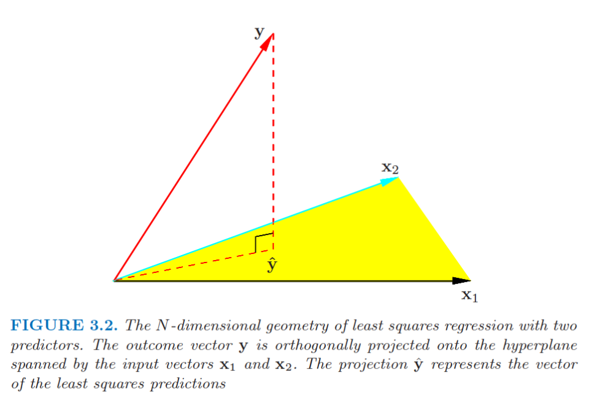{fig-align="center" width="60%"}

## Gauss–Markov Theorem

Among all possible [linear, unbiased]{style="color: maroon;"} estimators of $\mathbf a^T\boldsymbol\beta$,

$$
\mathbf a^T\widehat{\boldsymbol\beta}_{LS},
\qquad
\widehat{\boldsymbol\beta}_{LS}
=(\mathbf X^T\mathbf X)^{-1}\mathbf X^T\mathbf y,
$$

has the lowest variance when

- the errors are uncorrelated, and
- the errors have the same variance.

:::{.fragment}
Therefore, $\widehat{\boldsymbol\beta}_{LS}$ is the **Best Linear Unbiased Estimator (BLUE)** of $\boldsymbol\beta$.
::: 

<br> 

:::{.fragment} 
**Implications**: 

  - Normality of $\epsilon_i$s not required
  - Identical distributions not required 
    - e.g. $y_1 \sim \mathcal{N}(0,1)$ and $y_2 \sim \text{Exp}(1)-1$
  - When $\epsilon_i$s are correlated to each other, GMT would not be applicable
  - GMT cannot be applied to non-linear estimators
::: 

## Gauss–Markov: Two-Sample Testing

Consider

$$
y_i=\beta_0+x_i\beta_1+\epsilon_i,
\qquad \epsilon_i\sim N(0,\sigma^2),
$$

where $x_i=1$ for group 1 and $x_i=0$ for group 2.

<br> 

:::{.fragment}
Setting $\mathbf a=(0,1)^T$ means that $\widehat\beta_1$ is BLUE for $\beta_1$. Its minimum variance makes it attractive when constructing a powerful test statistic.

<br> 

Note that this result relies on homoscedasticity, meaning equal variance across the groups.
::: 

## Knowledge Check: Does Gauss–Markov Apply?

For each situation, discuss whether we can conclude that the least-squares estimator is BLUE.

1. The errors are strongly right-skewed, but they are uncorrelated and have the same variance.

2. The errors are normally distributed, but their variance increases as the fitted value increases.

3. Each participant contributes five observations, and measurements from the same participant tend to be similar.

4. A researcher proposes an unbiased estimator that is a cubic function of the responses.

## Gauss–Markov Theorem: Proof

[Optional, if interested]{style="color: maroon;"}

<br>

Let $\widetilde{\boldsymbol\beta}=\mathbf C\mathbf y$ be another linear estimator. Write $\mathbf C=(\mathbf X^T\mathbf X)^{-1}\mathbf X^T+\mathbf D.$

For $\widetilde{\boldsymbol\beta}$ to be unbiased,

$$
E[\widetilde{\boldsymbol\beta}]
=\boldsymbol\beta+\mathbf D\mathbf X\boldsymbol\beta,
$$

so $\mathbf D\mathbf X=0$. Then

$$
\begin{aligned}
\operatorname{Cov}(\widetilde{\boldsymbol\beta})
&=\sigma^2\mathbf C\mathbf C^T\\
&=\sigma^2(\mathbf X^T\mathbf X)^{-1}+\sigma^2\mathbf D\mathbf D^T.
\end{aligned}
$$

Thus,

$$
\operatorname{Var}(\mathbf a^T\widetilde{\boldsymbol\beta})
=\operatorname{Var}(\mathbf a^T\widehat{\boldsymbol\beta}_{LS})
+\sigma^2\mathbf a^T\mathbf D\mathbf D^T\mathbf a
\geq \operatorname{Var}(\mathbf a^T\widehat{\boldsymbol\beta}_{LS}).
$$

## Likelihood Perspective of Least Squares

If $\boldsymbol\epsilon\sim N_n(\mathbf0,\sigma^2\mathbf I)$, then

$$
L(\boldsymbol\beta,\sigma^2;\mathbf y)
=\frac{1}{(2\pi\sigma^2)^{n/2}}
\exp\left\{-\frac{1}{2\sigma^2}
(\mathbf y-\mathbf X\boldsymbol\beta)^T
(\mathbf y-\mathbf X\boldsymbol\beta)\right\}.
$$

:::{.fragment}
The log-likelihood is

$$
\log L(\boldsymbol\beta,\sigma^2;\mathbf y)
=-\frac n2\log(\sigma^2)
-\frac{1}{2\sigma^2}
(\mathbf y-\mathbf X\boldsymbol\beta)^T
(\mathbf y-\mathbf X\boldsymbol\beta)+C.
$$
::: 

:::{.fragment}
Maximizing it gives

$$
\widehat{\boldsymbol\beta}_{MLE}
=(\mathbf X^T\mathbf X)^{-1}\mathbf X^T\mathbf y
=\widehat{\boldsymbol\beta}_{LS}.
$$
::: 

:::{.fragment} 
Therefore, $\widehat{\boldsymbol\beta}_{MLE} = \widehat{\boldsymbol\beta}_{LS}$
:::

## Why Maximum Likelihood?

- The Gauss–Markov theorem compares linear, unbiased estimators only.

<br> 

- Maximum likelihood estimators have useful large-sample properties:
  - **Asymptotic unbiasedness:** bias approaches zero as $n\to\infty$.
  - **Asymptotic efficiency:** among regular, asymptotically unbiased estimators, the MLE achieves the smallest possible variance asymptotically.

<br> 

- Under the normal linear model, $\widehat{\boldsymbol\beta}_{MLE}$ is unbiased even in finite samples.

# Construction of $t$ and $F$ Tests

## Hypothesis Testing in Least Squares

Under the multivariate normal model,

$$
\widehat{\boldsymbol\beta}_{MLE}
\sim N_{p+1}\left(
\boldsymbol\beta,
\sigma^2(\mathbf X^T\mathbf X)^{-1}
\right).
$$

:::{.fragment}
**Implications:**

- $\widehat\beta_j\sim N\left(\beta_j,\{\sigma^2(\mathbf X^T\mathbf X)^{-1}\}_{j,j}\right).$ 
- After transformation, 

$$ \frac{\widehat{\beta}_j - \beta_j}{\sqrt{\{\sigma^2\left(\mathbf{X^T\mathbf{X}}\right)^{-1}\}_{j,j}}} \sim \mathcal{N}(0,1)$$

- Under $H_0:\beta_j=0$,

$$
Z=\frac{\widehat\beta_j}
{\sqrt{\{\sigma^2(\mathbf X^T\mathbf X)^{-1}\}_{jj}}}
\sim N(0,1).
$$

This is a [$z$ test when $\sigma^2$ is known]{style="color: maroon;"}.
::: 

## Estimating the Error Variance

The problem is that $\sigma^2$ is usually [unknown]{style="color: maroon;"}.

The maximum likelihood estimator is

$$
\widehat\sigma^2_{MLE}
=\frac{1}{n}
(\mathbf y-\mathbf X\widehat{\boldsymbol\beta})^T
(\mathbf y-\mathbf X\widehat{\boldsymbol\beta}).
$$

:::{.fragment}
However,

$$
E[\widehat\sigma^2_{MLE}]
=\frac{n-p-1}{n}\sigma^2,
$$

so it is [biased]{style="color: maroon;"}. 
::: 

:::{.fragment} 
Note: 

$$
\frac{(\mathbf y-\mathbf X\widehat{\boldsymbol\beta}_{LS})^T
(\mathbf y-\mathbf X\widehat{\boldsymbol\beta}_{LS})}{\sigma^2}
\sim \chi^2_{n-p-1}.
$$
:::
## Review of Probability

1. If $X\sim N(0,1)$, $Y\sim\chi_q^2$, and $X$ and $Y$ are independent, then

$$
\frac{X}{\sqrt{Y/q}}\sim t_q.
$$

2. If $X\sim\chi_p^2$, $Y\sim\chi_q^2$, and $X$ and $Y$ are independent, then

$$
\frac{X/p}{Y/q}\sim F_{p,q}.
$$

## Construction of the $t$ Test

Under $H_0:\beta_j=0$,

$$
T=
\frac{\widehat\beta_j}
{\sqrt{\{\widehat\sigma^2(\mathbf X^T\mathbf X)^{-1}\}_{jj}}}.
$$

:::{.fragment}
Rewrite this as

$$
T=
\frac{
\widehat\beta_j/
\sqrt{\{\sigma^2(\mathbf X^T\mathbf X)^{-1}\}_{jj}}
}{
\sqrt{\widehat\sigma^2/\sigma^2}
}.
$$
::: 

:::{.fragment}
Using

$$
\widehat\sigma^2
=\frac{(\mathbf y-\mathbf X\widehat{\boldsymbol\beta})^T
(\mathbf y-\mathbf X\widehat{\boldsymbol\beta})}{n-p-1},
$$

the numerator is standard normal and the squared denominator is $\chi^2_{n-p-1}/(n-p-1)$. These quantities are [independent]{style="color: maroon;"} under $H_0$, so

$$
T\sim t_{n-p-1}.
$$
::: 

## Construction of the $F$ test

[Motivation]{style="color: maroon;"}

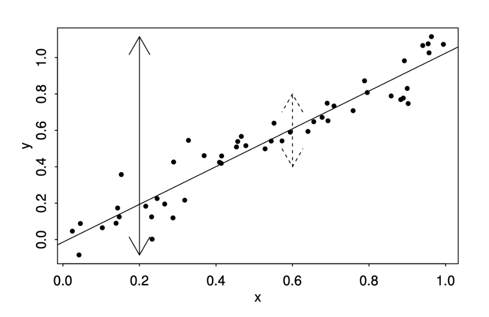{fig-align="center" width="60%"}

Let $\mathbf X=[\mathbf X_1,\mathbf X_2]$. Then

$$
\min_{\boldsymbol\beta,\boldsymbol\gamma}
\|\mathbf y-\mathbf X_1\boldsymbol\beta-\mathbf X_2\boldsymbol\gamma\|^2
\leq
\min_{\boldsymbol\beta}
\|\mathbf y-\mathbf X_1\boldsymbol\beta\|^2.
$$

which implies that the addition of covariates would lead to a reduced SSE.

If I add more predictors, the fit can only improve - but is the improvement large enough to matter?

## Construction of the $F$ Test

:::: {.columns}

::: {.column width="45%"}

Consider the hypothesis

$$
H_0:\beta_1=\cdots=\beta_p=0.
$$

<br> 

In an introductory regression course, we typically extract the $F$ statistic from the ANOVA table and compare it with an $F$ distribution to calculate a $p$-value.

:::

::: {.column width="55%"}

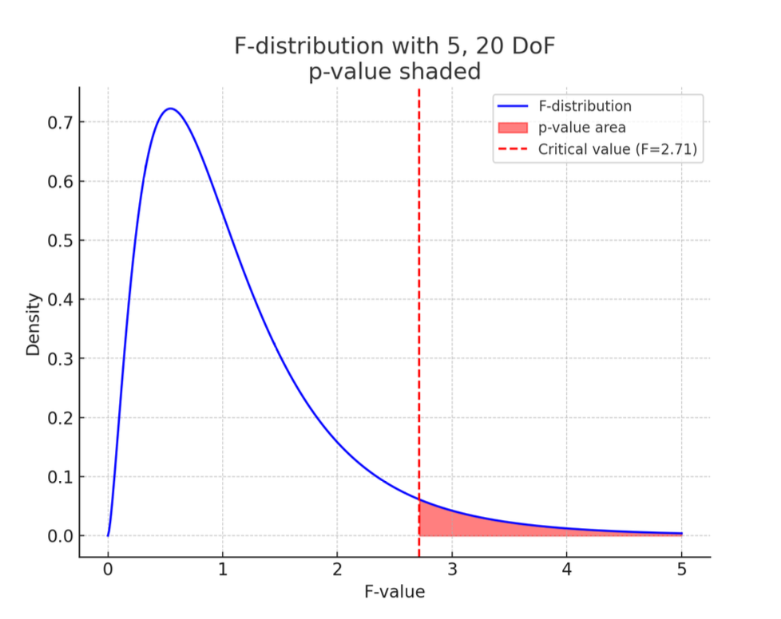{fig-align="center" width="100%"}

:::

::::

## Construction of the $F$ Test

For a mean-centered response,

$$
\underbrace{\sum_{i=1}^n(y_i-\bar y)^2}_{SST}
=
\underbrace{\sum_{i=1}^n(y_i-\mathbf x_i^T\widehat{\boldsymbol\beta})^2}_{SSE}
+
\underbrace{\sum_{i=1}^n(\mathbf x_i^T\widehat{\boldsymbol\beta})^2}_{SS_{Reg}}.
$$

- $SST$ is the SSE under $H_0$.
- $SSE$ is the SSE under the full model.

<br> 

Under $H_0:\beta_1=\cdots=\beta_p=0$,

$$
F=\frac{SS_{Reg}/p}{SSE/(n-p-1)}
\sim F_{p,n-p-1}.
$$

## Construction of the $F$ Test

**A direct method**: use distributional properties 

  - Note that $\boldsymbol{\widehat{\beta}} \sim \mathcal{MVN}(\boldsymbol{\beta}, \sigma^2\left(\boldsymbol{X}^T\boldsymbol{X}\right)^{-1}$. Then, under $H_0:\boldsymbol\beta=\mathbf0$,

$$
\frac{SS_{Reg}}{\sigma^2}
=\widehat{\boldsymbol\beta}^{,T}
\left(\frac{\mathbf X^T\mathbf X}{\sigma^2}\right)
\widehat{\boldsymbol\beta}
\sim\chi_p^2.
$$

:::{.fragment}
  - From the previous slides,

$$
\frac{SSE}{\sigma^2}
=\frac{(\mathbf y-\mathbf X\widehat{\boldsymbol\beta})^T
(\mathbf y-\mathbf X\widehat{\boldsymbol\beta})}{\sigma^2}
\sim\chi^2_{n-p-1}.
$$
::: 

:::{.fragment}
  - The regression and residual components are independent because they are orthogonal projections:

$$
(\mathbf I-\mathbf P)\mathbf P=\mathbf0.
$$

The ratio of the two scaled independent chi-squared variables therefore follows an $F$ distribution.
::: 

## Notes on the $F$ Test

- When testing one regression coefficient, the $F$ test and the two-sided $t$ test are equivalent:

$$
F_{1,n-p-1}=T_{n-p-1}^2.
$$

- The $F$ test is not the only way to test regression coefficients. Alternative procedures may offer more power in particular settings.
- Exact $t$ and $F$ tests rely on normally distributed errors to derive the null distributions.
  - With sufficiently large samples, asymptotic approximations may still work when normality fails.

## Extensions: Linear Hypothesis

Consider

$$
y_i=\beta_0+x_{i1}\beta_1+\cdots+x_{i8}\beta_8+\epsilon_i,
$$

where:

- `PRICE`: selling price in thousands of dollars
- `FLR`: floor space in square feet
- `RMS`: number of rooms
- `BDR`: number of bedrooms
- `BTH`: number of bathrooms
- `GAR`: garage size
- `LOT`: front footage of the lot
- `FP`: number of fireplaces
- `ST`: indicator for storm windows

## Extensions: Linear Hypothesis

:::: {.columns}

::: {.column width="45%"}

1. Do floor area and lot size affect price equally?

$$H_0:\beta_1-\beta_6=0.$$

2. Does either floor area or lot size affect price?

$$H_0:\beta_1=\beta_6=0.$$

3. Could storm windows add $\$6{,}000$ and a garage add $\$4{,}000$ to the price?

$$H_0:\beta_5=4,\quad\beta_8=6.$$

Each is a special case of the general linear hypothesis
$$
H_0:\mathbf A\boldsymbol\beta=\mathbf c.
$$

:::

::: {.column width="55%"}

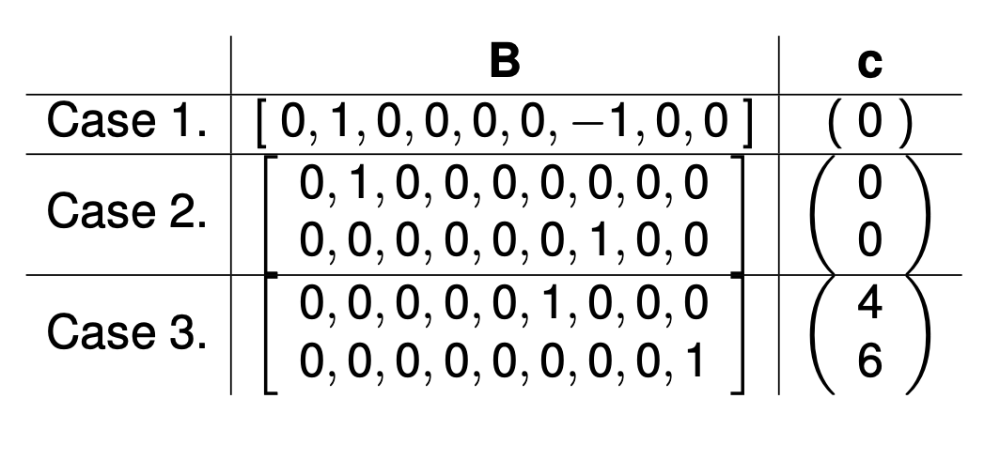{fig-align="center" width="70%"}

:::

::::


## Extensions: Linear Hypothesis

To test $H_0:\mathbf A\boldsymbol\beta=\mathbf c$, use

$$
F=
\frac{1}{q}
\frac{
(\mathbf A\widehat{\boldsymbol\beta}-\mathbf c)^T
[\mathbf A(\mathbf X^T\mathbf X)^{-1}\mathbf A^T]^{-1}
(\mathbf A\widehat{\boldsymbol\beta}-\mathbf c)
}{\widehat\sigma^2}
\sim F_{q,n-p-1},
$$

under $H_0$, where

- $q$ is the number of rows in $\mathbf A$,
- $\widehat\sigma^2$ is the MSE from the full model.

## Extensions: Linear Hypothesis

```{webr}
library(car) # package for linear hypothesis
library(SenSrivastava) # package for data
data(E2.2)

fit <- lm(
  Price ~ FLR + RMS + BDR + BTH + GAR + LOT + FP + ST,
  data = E2.2
)

A <- matrix(
  c(
    0, 0, 0, 0, 0, 1, 0, 0, 0,  # beta_5 = 4
    0, 0, 0, 0, 0, 0, 0, 0, 1   # beta_8 = 6
  ),
  nrow = 2,
  byrow = TRUE
)

c_vec <- c(4, 6)

linearHypothesis(fit, hypothesis.matrix = A, rhs = c_vec)
```


# Linear Model Assumptions and Violations

## Summary of Assumptions

1. **Linearity** — generally straightforward to assess
2. **Normality** — generally straightforward to assess
3. **Constant variance** — more difficult to assess
4. **Independence of the errors** — often difficult to assess

## Consequences of Violations

**For prediction**

- Violating linearity can lead to severe bias.

<br> 

:::{.fragment}
**For inference**

- Violating constant variance or independence can produce inaccurate standard errors.
- Inaccurate standard errors can inflate the Type I error rate.

Violating normality is often less concerning with sufficiently large samples because the [Central Limit Theorem]{style="color: maroon;"} can justify approximate inference.
::: 

## Checking Assumptions

- Most assumptions concern the unobserved errors $\epsilon_i$.
  - We use the residuals $\widehat\epsilon_i$ as proxies.
  
- Under the data-generating process, $\mathbf X\boldsymbol\beta$ and $\boldsymbol\epsilon$ should not be associated in any way. 
  - Can be checked using a scatterplot
  
- A residual-versus-fitted plot can reveal nonlinearity and heteroscedasticity.

- A histogram or Q–Q plot of residuals can help assess normality.

## Checking Assumptions

[Residual Plot: Linearity, Heteroscedasticity]{style="color: maroon;"}

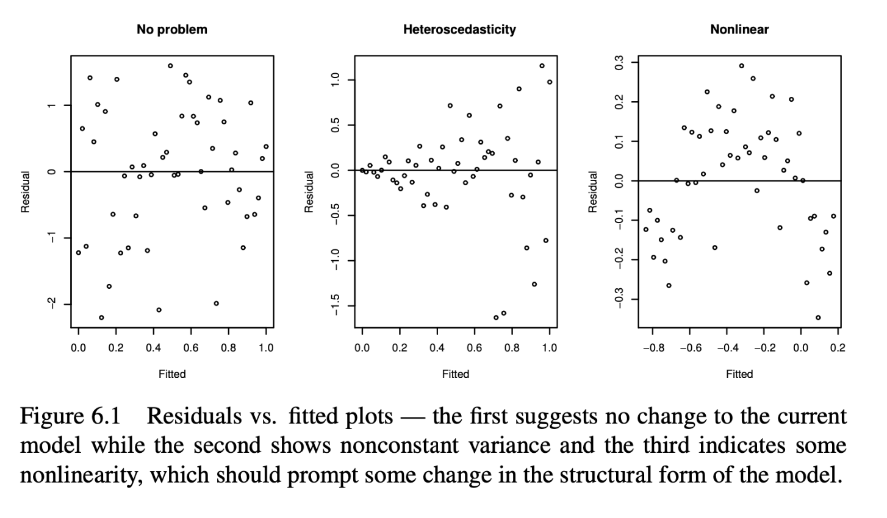{fig-align="center" width="70%"}

[Residual-versus-fitted plots]{style="color: maroon;"} can help identify:

- nonlinearity in the mean structure, and
- variance that changes with the fitted value or covariates.

For heteroscedasticity, the plot only allows us to investigate whether the noise variance appears to depend on observed covariates (i.e. limited investigation).

## Q–Q Plot

[QQ Plot: Normality]{style="color: maroon;"}

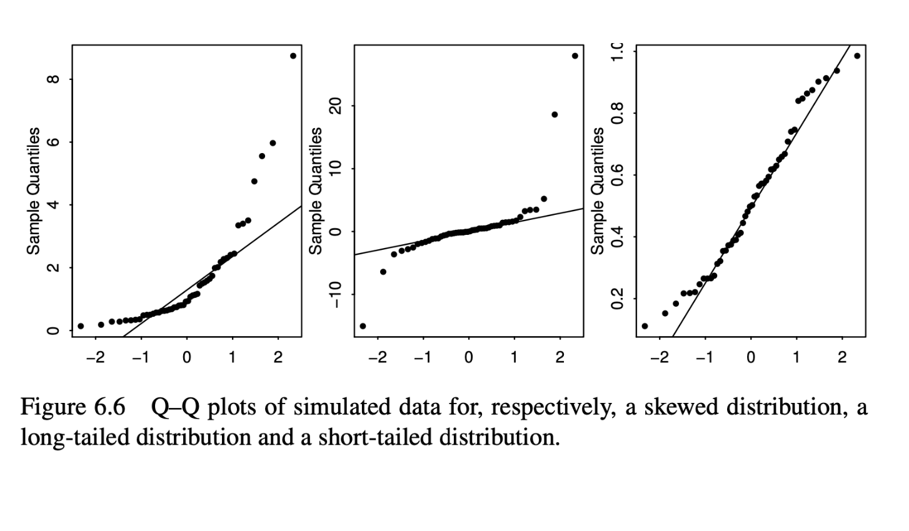{fig-align="center" width="70%"}

A [normal Q–Q plot]{style="color: maroon;"} compares the empirical residual quantiles with the theoretical quantiles of a normal distribution.

- Points close to a straight line support approximate normality.
- Systematic curvature can indicate skewness or heavy tails.
- Extreme departures at the ends can indicate unusual observations or tail behavior.

## Checking Assumptions 

[Checking Uncorrelatedness of Errors]{style="color: maroon;"}

With $n$ observations, there are $n(n-1)/2$ pairs of errors whose correlations might be considered. \
  
  - We [cannot]{style="color: maroon;"} use a completely data-drive approach to check this assumption
  - It could be investigated based on the data and study characteristics

For example, we can build a linear model to predict the air quality since 1856 and then subsequently use this to predict earlier air quality based on proxy information.

  - In this case, we know there might be time-dependent correlations in noise (i.e. temporal autocorrelations).
  - If $\epsilon_i$s are truly uncorrelated, any combination of $\epsilon_i$s should be uncorrelated as well .
  - We may check $\operatorname{cor}(\widehat\epsilon_i,\widehat\epsilon_{i+1})$ to determine if there is any temporal dependence.

$$
\operatorname{Cor}(\widehat\epsilon_i,\widehat\epsilon_{i+1}).
$$

## Checking Assumptions

[Checking Uncorrelatedness of Errors]{style="color: maroon;"}

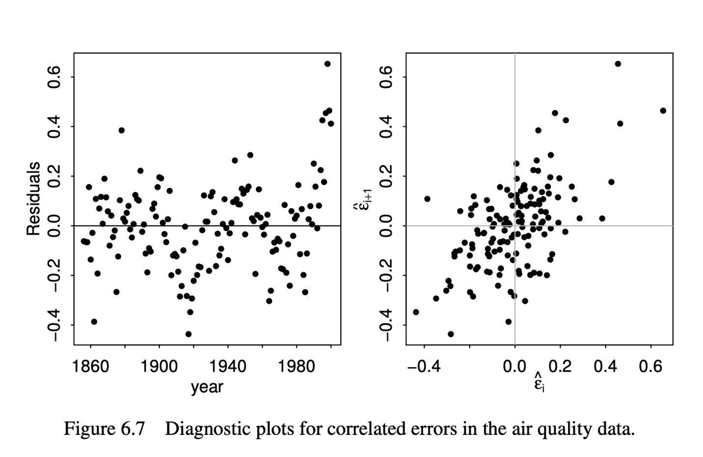{fig-align="center" width="70%"}

## Checking Assumptions

[Outliers?]{style="color: maroon;"}


- There is no universal quantitative definition of an outlier.
- Measures such as [Cook's distance, standardized residuals]{style="color: maroon;"}, and [DFFITS]{style="color: maroon;"} can identify influential observations. 
  - A large Cook's distance, for instance, indicates that the observation is influential
- Investigate possible explanations:
  - Was there a data-entry or measurement error?
  - Is the observation scientifically possible?
- If unusual observations can naturally occur, deleting them may distort the target population.
- Ideally, define exclusion rules during study planning, before examining the data.
- Robust regression can reduce sensitivity to unusual observations without automatically excluding them.

## Outlier Diagnostics

[Real Consequence]{style="color: maroon;"} 

<br> 

- NASA launched the *Nimbus 7* satellite to record atmospheric information 
- After several years of operation in 1985, the British Antarctic Survey observed a large decrease in atmospheric ozone over the Antarctic 
- Turns out, the data processing program was automatrically discarding extremely low observations because they were assumed to be mistakes 
- Thus the discovery of the Antarctic ozone hole was delayed by several years

## Activity: Keep, Correct, Exclude, or Investigate?

Justify your decision and explain what the researcher should report.

<br>

**Case 1:** A participant's weight is recorded as 720 kg. The original questionnaire shows that the participant reported a weight of 72.0 kg.

**Case 2:** An air-pollution measurement is extremely high. Maintenance records confirm that the sensor malfunctioned during that measurement.

**Case 3:** A household-income study includes one billionaire. The observation has a large Cook's distance.

**Case 4:** An observation is correctly recorded, scientifically plausible, and belongs to the target population. Removing it changes the primary result from $p=0.08$ to $p=0.03$.

**Case 5:** A study was designed for adults aged 18–65, but researchers later discover that one enrolled participant was 16 years old. 

**Case 6:** An air-pollution monitor records a value nearly ten times higher than its usual measurements. A wildfire was reported in the region that day. However, the monitor had also produced a calibration warning earlier that week. Nearby monitors were offline, so there are no direct measurements available for comparison.

# Weighted Least Squares

## Weighted Least Squares

Given known positive variance factors $w_1,\ldots,w_n$, the WLS estimator minimizes

$$
\widehat{\boldsymbol\beta}_{WLS}
=\underset{\boldsymbol\beta}{\arg\min}
\sum_{i=1}^n\frac{1}{w_i}
(y_i-\mathbf x_i^T\boldsymbol\beta)^2.
$$

If $\mathbf W=\operatorname{diag}(w_1,\ldots,w_n)$, then

$$
\widehat{\boldsymbol\beta}_{WLS}
=\underset{\boldsymbol\beta}{\arg\min}
(\mathbf y-\mathbf X\boldsymbol\beta)^T
\mathbf W^{-1}
(\mathbf y-\mathbf X\boldsymbol\beta),
$$

and

$$
\widehat{\boldsymbol\beta}_{WLS}
=(\mathbf X^T\mathbf W^{-1}\mathbf X)^{-1}
\mathbf X^T\mathbf W^{-1}\mathbf y.
$$

## Weighted Least Squares

- Do we really need weights in estimation of $\boldsymbol{\beta}$? 
  - We already have GMT or the properties of ML! 
  
- However, don't forget they require certain assumptions 
  - Specifically, the constant-variance assumption
  - Least squares is BLUE only under these assumptions

:::{.fragment}
Consider instead

$$
y_i=\mathbf x_i^T\boldsymbol\beta+\epsilon_i,
\qquad
\epsilon_i\sim N(0,w_i\sigma^2),
$$

with independent errors. In matrix form,

$$
\mathbf y=\mathbf X\boldsymbol\beta+\boldsymbol\epsilon,
\qquad
\boldsymbol\epsilon\sim N_n(\mathbf0,\sigma^2\mathbf W).
$$

[If the error variances differ, ordinary least squares may no longer have the smallest variance.]{style="color: maroon;"}
::: 

## Comparing LS and WLS

Both estimators are unbiased:

$$
E[\widehat{\boldsymbol\beta}_{LS}]=\boldsymbol\beta,
\qquad
E[\widehat{\boldsymbol\beta}_{WLS}]=\boldsymbol\beta.
$$

Their covariance matrices differ:

$$
\operatorname{Cov}(\widehat{\boldsymbol\beta}_{LS})
=\sigma^2(\mathbf X^T\mathbf X)^{-1}
\mathbf X^T\mathbf W\mathbf X
(\mathbf X^T\mathbf X)^{-1},
$$

whereas

$$
\operatorname{Cov}(\widehat{\boldsymbol\beta}_{WLS})
=\sigma^2(\mathbf X^T\mathbf W^{-1}\mathbf X)^{-1}.
$$

Which estimator is more efficient under this heteroscedastic model?

## Transforming the Model

Consider the following transformation:

$$
\underbrace{\mathbf W^{-1/2}\mathbf y}_{\mathbf y^*}
=
\underbrace{\mathbf W^{-1/2}\mathbf X}_{\mathbf X^*}
\boldsymbol\beta
+
\underbrace{\mathbf W^{-1/2}\boldsymbol\epsilon}_{\boldsymbol\epsilon^*}.
$$

Now $\operatorname{Var}(\boldsymbol\epsilon^*)=\sigma^2\mathbf I,$ (constant variance), where GMT is applicable

Therefore, $[(\mathbf X^*)^T\mathbf X^*]^{-1}(\mathbf X^*)^T\mathbf y^*$ is the BLUE for $\boldsymbol{\beta}$! 
  - But it is equivalent to $\widehat{\boldsymbol\beta}_{WLS}$

Note that in this case, $\widehat{\boldsymbol\beta}_{WLS} = \widehat{\boldsymbol\beta}_{MLE}$, but $\widehat{\boldsymbol\beta}_{WLS} \neq \widehat{\boldsymbol\beta}_{LS}$

## WLS Simulation

```{webr}
library(MASS)
set.seed(442)

n <- 50
wts <- rchisq(n, df = 1)
x <- rnorm(n)
pval_ls <- numeric(10000)
pval_wls <- numeric(10000)

for (sim in 1:10000) {
  eps <- rnorm(n, mean = 0, sd = sqrt(wts))
  y <- 3 + eps  # generated under H0: beta_1 = 0

  fit_ls <- lm(y ~ x)
  pval_ls[sim] <- coef(summary(fit_ls))[2, 4]

  fit_wls <- lm(y ~ x, weights = 1 / wts)
  pval_wls[sim] <- coef(summary(fit_wls))[2, 4]
}

mean(pval_wls < 0.05)  # approximately 0.05
mean(pval_ls < 0.05)   # inflated Type I error
```

## Heteroscedasticity

:::: {.columns}

::: {.column width="45%"}

A plausible scenario is that variance depends on a covariate:

$$
y_i\sim N(\beta_0+x_i\beta_1,\sigma^2x_i^2).
$$

```{webr}
n <- 100
x <- runif(n)
y <- numeric(n)

for (i in 1:n) {
  y[i] <- rnorm(1, mean = 3 + x[i], sd = x[i])
}
```

- LS and WLS are both unbiased for the regression coefficients.
- LS can still produce unbiased mean predictions.
- Exploratory plots can help detect nonconstant variance.

:::

::: {.column width="55%"}

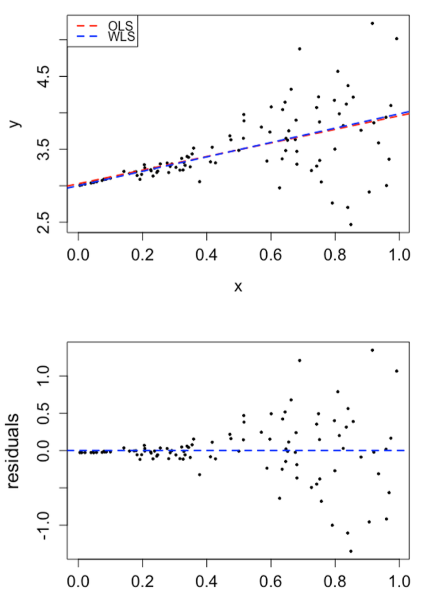{fig-align="center" width="80%"}

:::

::::

## Heteroscedasticity

Repeated simulations show that WLS can substantially reduce standard errors relative to LS when the variance weights are correctly specified.

If the weights are misspecified, WLS may lose this advantage. The variance model therefore requires careful justification.

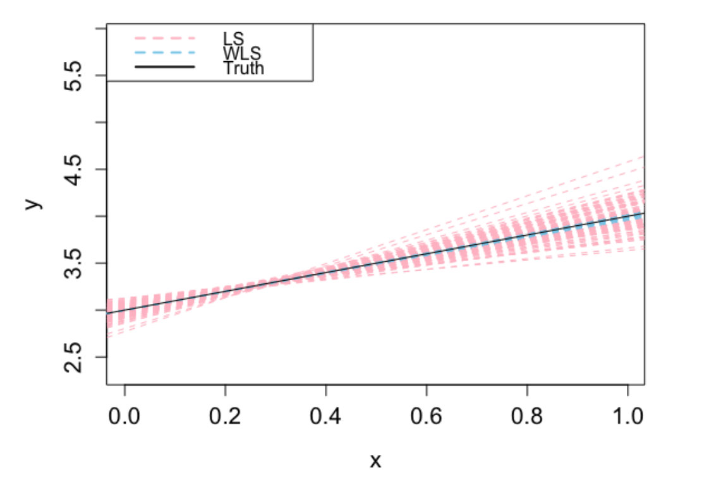{fig-align="center" width="80%"}

# Modeling Considerations

## Overfitting and Bias

Suppose the true model is $E[\mathbf y]=\mathbf X_1\boldsymbol\beta_1,$ where $\mathbf X_1$ contains the first $k$ columns of $\mathbf X=(\mathbf X_1,\mathbf X_2)$. Then

$$
E[\widehat{\boldsymbol\beta}]
=(\mathbf X^T\mathbf X)^{-1}\mathbf X^T\mathbf X_1\boldsymbol\beta_1
=
\begin{bmatrix}\boldsymbol\beta_1\\\mathbf0\end{bmatrix}.
$$

Therefore, $\widehat{\boldsymbol{\beta}}$ is (still) unbiased for $\boldsymbol{\beta_1}$

The fitted values are also unbiased:

$$
E[\widehat{\mathbf y}]
=\mathbf X
\begin{bmatrix}\boldsymbol\beta_1\\\mathbf0\end{bmatrix}
=\mathbf X_1\boldsymbol\beta_1.
$$

Because $(\mathbf I-\mathbf P)\mathbf X=\mathbf0$,

$$
E[\widehat\sigma^2]=\sigma^2.
$$

Including unnecessary variables does not introduce bias under these assumptions.

## Overfitting and Bias

If adding unnecessary covariates does not induce bias, [why avoid it?]{style="color: maroon;"}

:::{.fragment}
Bias is not the only consideration. In the overfitted model,

$$
\operatorname{Cov}(\widehat{\boldsymbol\beta})_{1:k,1:k}
=\sigma^2(\mathbf X^T\mathbf X)^{-1}_{1:k,1:k}
\neq
\sigma^2(\mathbf X_1^T\mathbf X_1)^{-1}.
$$
::: 

:::{.fragment}
By the Gauss–Markov theorem, estimating unnecessary coefficients increases the variability of the estimated coefficients of interest.
::: 

## Underfitting and Bias

Suppose the true model is $E[\mathbf y]=\mathbf X\boldsymbol\beta+\mathbf Z\boldsymbol\gamma,$ but the fitted model uses only $\mathbf X$. Then

$$
E[\widehat{\boldsymbol\beta}]
=\boldsymbol\beta
+(\mathbf X^T\mathbf X)^{-1}\mathbf X^T\mathbf Z\boldsymbol\gamma.
$$

- If $\mathbf X^T\mathbf Z\neq\mathbf0$, the estimator is biased.
- If $\mathbf X^T\mathbf Z=\mathbf0$, it remains unbiased.

The fitted values satisfy

$$
E[\widehat{\mathbf y}]
=\mathbf X\boldsymbol\beta+\mathbf P\mathbf Z\boldsymbol\gamma.
$$

Also,

$$
E[\widehat\sigma^2]
=\sigma^2+
\frac{\boldsymbol\gamma^T\mathbf Z^T(\mathbf I-\mathbf P)\mathbf Z\boldsymbol\gamma}
{n-p-1}
\geq\sigma^2.
$$

## Underfitting and Bias

[**Simpson's paradox:**]{style="color: maroon;"} a trend appears within several groups but disappears or reverses when the groups are combined.

<br> 

A [**confounder**]{style="color: maroon;"} is associated with both the response and a predictor.

<br> 

For example,

$$
y_i=\beta_0+x_i\beta_1+z_i\beta_2+\epsilon_i
$$

and

$$
z_i=\gamma_0+x_i\gamma_1+\delta_i.
$$

If $z_i$ is omitted, the simple-regression slope has bias $\gamma_1\beta_2$. The direction and size of the omitted-variable bias depend on both the association between $x$ and $z$ and the effect of $z$ on $y$.

## Simpson's Paradox

An [ecological fallacy]{style="color: maroon;"} occurs when conclusions about individuals are incorrectly drawn from group-level patterns.

For example, suppose $z$ is a two-group factor such as sex. A regression line fitted after combining the groups can differ substantially from the within-group relationship obtained after adjusting for $z$.

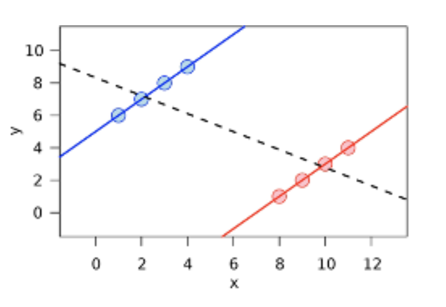{fig-align="center" width="80%"}

# Model Selection

## Motivation for Model Selection

Which model is better? 

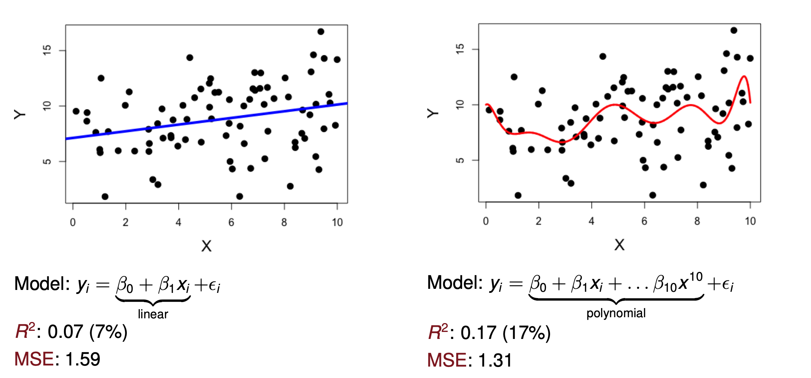{fig-align="center" width="80%"}

## Motivation for Model Selection

The goal is not to fit the [observed data]{style="color: maroon;"} perfectly. We want to understand the [population]{style="color: maroon;"} that generated the data and predict new observations well.

When performance is evaluated on [new data (blue points)]{style="color: maroon;"}:

- Linear-model test MSE: $5.13$
- Polynomial-model test MSE: $6.65$

Although the polynomial fits the training data better, the linear model generalizes better in this example.

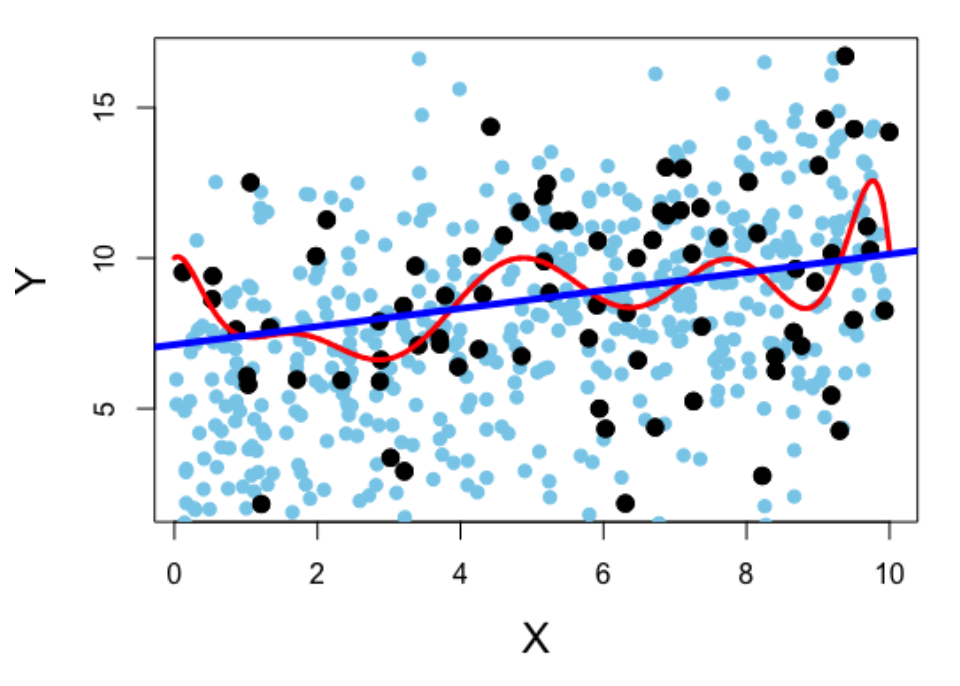{fig-align="center" width="80%"}

## Model Selection

How should we choose a subset of predictors?

- Including every available variable can increase estimation noise and reduce interpretability.
- We want a model that explains or predicts the response well without unnecessary complexity.

<br> 

**Common approaches include:**

1. Testing-based procedures
2. Adjusted $R^2$
3. Information criteria
4. Cross-validation

Testing-based procedures are generally not recommended as the primary selection strategy. The other approaches explicitly account for complexity or out-of-sample performance.

## Testing-Based Methods

**Forward selection**

1. Start with no predictors.
2. Add the predictor with the smallest $p$-value (most statistically significant)
3. Stop when no remaining predictor meets the chosen threshold.

:::{.fragment}
**Backward selection**

1. Start with all predictors.
2. Remove the predictor with the largest $p$-value.
3. Stop when all remaining predictors meet the threshold.
::: 

:::{.fragment}
**Stepwise selection**

1. Add predictors using forward selection.
2. After each addition, check whether any included predictor should be removed.
3. Stop when no addition or deletion meets the chosen criterion.
::: 

## Testing-Based Methods

**Advantages:**

- They can reduce model complexity.
- A smaller model may be easier to interpret.

<br> 

:::{.fragment}
**Disadvantages:**

- $p$-values depend strongly on sample size.
- Multicollinearity can cause important variables to appear nonsignificant.
- Data-driven selection can overfit.
::: 

## $R^2$

For a model $M$,

$$
R^2(M)=1-\frac{SSE(M)}{SST}
=\operatorname{Cor}(\mathbf y,\widehat{\mathbf y})^2,
$$

where

$$
SSE(M)=\|\mathbf y-\widehat{\mathbf y}_M\|_2^2,
\qquad
SST=\|\mathbf y-\bar y\mathbf1\|_2^2.
$$

Adding covariates can only decrease the training SSE, so $R^2$ can only increase.

Therefore, $R^2$ tends to favor larger models and is most useful when comparing models with the same number of predictors.

## Adjusted $R^2$

$$
R^2_{adj}(M)
=1-
\frac{SSE(M)/(n-p_M)}{SST/(n-1)}
=1-\frac{\widehat\sigma_M^2}{\widehat\sigma_{null}^2}.
$$

- $p_M$ is the number of parameters in model $M$, including the intercept.
- Dividing by $n-p_M$ penalizes larger models.
- Adjusted $R^2$ increases only when a new predictor improves fit enough to overcome this penalty.
- Adjusted $R^2$ can be negative.

## Information Criteria

Choose the model with the lowest information criterion.

$$
AIC(M)=-2\log L_M(\widehat\theta)+2p_M,
$$

$$
BIC(M)=-2\log L_M(\widehat\theta)+\log(n)p_M.
$$

Both criteria balance model fit against complexity.

For $n\geq8$, $\log(n)>2$, so BIC penalizes additional parameters more strongly than AIC.

<br> 

**Practical distinction:**

- AIC often favors predictive performance.
- BIC often favors identifying a smaller candidate model.

## AIC and Kullback–Leibler Divergence

[Optional, if interested]{style="color: maroon;"}

**Motivation of AIC:** The Kullback–Leibler divergence from a candidate model $g$ to the true density $f$ is

$$
KL(f,g)=\int \log\left\{\frac{f(z)}{g(z;\theta)}\right\}f(z)\,dz.
$$

It measures the discrepancy between the fixed true distribution $f$ and a candidate model $g$.

Properties:

- $KL(f,g)$ is not symmetric.
- $KL(f,g)\geq0$.
- $KL(f,g)=0$ only when the distributions agree almost everywhere.
- Up to a constant that does not depend on $g$,

$$
KL(f,g)=-\int\log g(z;\theta)f(z)\,dz+C.
$$

## AIC and Kullback–Leibler Divergence

[Optional, if interested]{style="color: maroon;"}

**AIC and KL-divergence relationship** 

Because $\theta$ is unknown, substitute the MLE from the observed data $\mathbf Y$:

$$
\Delta
:=-\int \log g(z;\widehat\theta_{MLE})f(z)\,dz
=-E_Z[\log g(Z;\widehat\theta_{MLE})],
$$

where $Z$ is independent of the training data $\mathbf Y$.

For linear regression with known $\sigma^2$, it can be shown that

$$
E_{\mathbf Y}[AIC]
=E_{\mathbf Y}[2\Delta]+C.
$$

This motivates AIC as an estimate of expected out-of-sample discrepancy, up to an additive constant.

## BIC and Bayesian Model Selection

[Optional, if interested]{style="color: maroon;"}

Consider a linear model with known $\sigma^2$ and a candidate submodel

$$
\mathbf y=\mathbf X_p\boldsymbol\beta_p+\boldsymbol\epsilon.
$$

- $p$ may be smaller than the total number of available covariates.
- Suppose $\boldsymbol\beta_p$ has a multivariate normal prior.

Under regularity conditions and a large-sample approximation to the marginal likelihood, the BIC arises as

$$
BIC=-2\log L(\widehat\theta)+p\log n.
$$

Smaller BIC values provide stronger approximate evidence for a candidate model.

## Cross-Validation

Cross-validation partitions the data into non-overlapping subsets and estimates predictive performance on observations that were not used to fit the model.

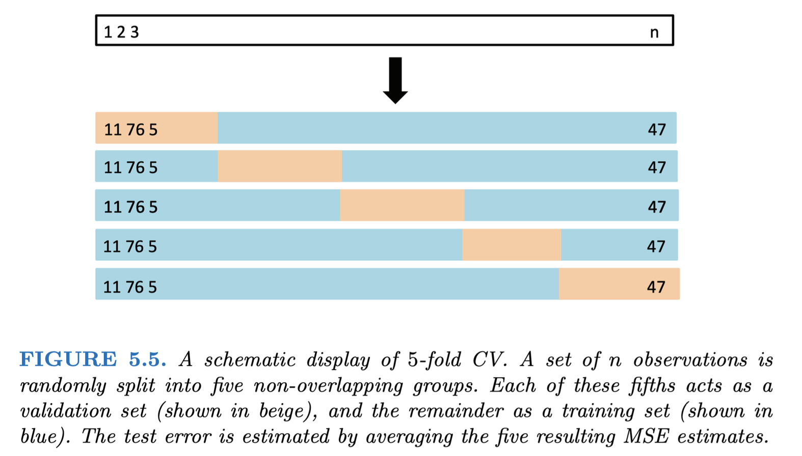{fig-align="center" width="80%"}

## Five-Fold Cross-Validation

To compare candidate models:

1. Divide the data into five folds.
2. Fit each candidate model using four folds.
3. Predict the observations in the held-out fold and calculate

$$
MSE_{test}=\frac{1}{n_{test}}
\|\mathbf y_{test}-\widehat f_{train}(\mathbf X_{test})\|_2^2.
$$

4. Repeat until each fold has served once as the test set.
5. Average the five test MSE values for each model.
6. Select the model with the lowest average cross-validated MSE.

## Five-Fold Cross-Validation in R

```{webr}
set.seed(442)
n <- 100
x <- rnorm(n)
y <- 3 * x + rnorm(n)
data <- data.frame(x = x, y = y)

n_folds <- 5
fold_id <- sample(rep(1:n_folds, length.out = n))
mse1 <- numeric(n_folds)
mse2 <- numeric(n_folds)

for (i in 1:n_folds) {
  train_data <- data[fold_id != i, ]
  test_data <- data[fold_id == i, ]

  model1 <- lm(y ~ x, data = train_data)
  model2 <- lm(y ~ poly(x, 2), data = train_data)

  pred1 <- predict(model1, newdata = test_data)
  pred2 <- predict(model2, newdata = test_data)

  mse1[i] <- mean((pred1 - test_data$y)^2)
  mse2[i] <- mean((pred2 - test_data$y)^2)
}

mean(mse1)
mean(mse2)
```

## Cross-Validation and Data Leakage

The test fold must remain [completely separate from model training]{style="color: maroon;"}.

<br> 

:::{.fragment}
Suppose we want to predict LDL cholesterol using expression levels from 20,000 genes for 700 subjects. We first screen all 20,000 genes using the full dataset, retain 50 genes with the smallest $p$-values, and then compare classifiers using 10-fold cross-validation.
::: 

:::{.fragment}
This procedure is invalid because the held-out observations influenced which genes entered the model.

Information from the test folds has leaked into training, producing an overly optimistic estimate of predictive performance.
::: 

## Preventing Data Leakage

Feature selection must occur [separately]{style="color: maroon;"} within each training fold.

<br> 

:::{.fragment}
For each fold:

1. Split the observations into training and test sets.
2. Screen genes using the training set only.
3. Fit each model using only the predictors selected from that training set.
4. Evaluate the fitted models on the held-out test set.
::: 

<br> 

:::{.fragment}
Any data-dependent preprocessing must occur inside the cross-validation loop, including variable selection, imputation, scaling, and tuning.
:::

## Summary

We've covered quite a few topics over the last few weeks but what ties them all together is that all topics are related to linear models. Some methods (such as cross validation) can be extended to other types of models, but introducing them via linear models is the most natural. 

- We reviewed the OLS estimator of the linear regression coefficients, and now know that, by the Gauss-Markov Theorem, this is the Best Linear Unbiased Estimator
- We related the OLS estimator the the MLE estimator, and discussed why we would consider an MLE estimator instead
- We went through the details of constructing the $t$ and $F$ hypothesis tests, and showed how we can represent a linear hypothesis in matrix notation
- When assuming a linear model, there are certain assumptions that need to hold; we reviewed assumption diagnostics and went through one remedy to a violation of the constant variance assumption (weighted least squares) 
- We ended this topic reviewing model selection techniques

**Next two lectures:** Generalized Linear Models 

**Announcements:** First assignment due Oct 2nd
